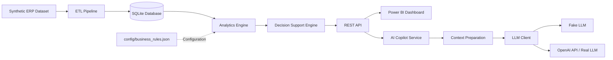

# AI Supply Chain Copilot

> 🚀 **Current Release:** **v1.0.0 — Functional AI Copilot**


<p align="center">
  
</p>

> **End-to-end Supply Chain Decision Support platform combining deterministic analytics, business rules, REST APIs, Business Intelligence and Generative AI.**

The application integrates a deterministic Supply Chain analytics engine with a real Large Language Model (LLM), enabling natural-language interpretation of structured inventory insights while preserving business rules and calculations outside the probabilistic AI layer.

An enterprise-inspired software engineering portfolio that combines **Supply Chain expertise, Data Engineering and Artificial Intelligence** to solve realistic inventory management problems using fully synthetic ERP data.

Rather than presenting isolated coding exercises, this repository evolves incrementally into a maintainable business application, demonstrating practical skills in software engineering, analytics, automation and AI.

---

# Table of Contents

- Overview
- Current Status
- Main Objectives
- Technology Stack
- Solution Architecture
- AI Copilot
- Project Structure
- Project Presentation
- Getting Started
- Automated Tests
- Automated Project Audit
- Engineering Practices
- Business Rules Configuration
- Development Workflow
- Roadmap
- Version History
- Current Development Stage
- Why this project?
- Repository Purpose
- License

---

# Overview

The objective of this project is to demonstrate how modern Supply Chain challenges can be addressed through software engineering and artificial intelligence.

The application simulates an enterprise inventory management environment, combining:

- Python
- ETL Pipelines
- SQLite
- Data Analytics
- Business Rules Engine
- Business Intelligence
- REST API
- Generative AI / LLM Integration

All datasets are fully synthetic and inspired by real business processes, preserving corporate confidentiality while maintaining realistic operational scenarios.

---

# Current Status

| Module | Status |
|----------|--------|
| Project Architecture | ✅ |
| Synthetic ERP Dataset | ✅ |
| ETL Pipeline | ✅ |
| SQLite Database | ✅ |
| Inventory Analytics | ✅ |
| Business Rules Engine | ✅ |
| Configurable Business Rules | ✅ |
| Automated Project Audit | ✅ |
| SQL Analytics | ✅ |
| KPI Engine | ✅ |
| REST API | ✅ |
| Power BI Dashboard | ✅ |
| AI Layer Foundation | ✅ |
| Automated Test Suite | ✅ |
| Real LLM Integration | ✅ |
| Real LLM Golden Set Validation | ✅ |
| Multi-Model Benchmark | ✅ |
| LLM Cost / Activation Safeguards | ✅ |
| Cloud Deployment | ⏳ |

---

# Main Objectives

This repository demonstrates practical implementation of:

- Data Engineering
- Software Engineering
- AI-enabled Solution Architecture
- Supply Chain Analytics
- Business Process Automation
- Decision Support Systems

The focus is not simply learning Python syntax, but designing maintainable business software following professional engineering practices.

---

# Technology Stack

| Category | Technologies |
|----------|--------------|
| Language | Python 3.14 |
| Data Processing | Pandas |
| Database | SQLite |
| API Framework | FastAPI |
| Business Intelligence | Power BI |
| Configuration | JSON |
| Version Control | Git / GitHub |
| IDE | Visual Studio Code |
| Documentation | Markdown |
| Automated Testing | Pytest |
| AI Integration | OpenAI API / Large Language Model |
| AI Architecture | Modular AI Layer with Real and Fake LLM Clients |

### Planned Technologies

- PostgreSQL
- Docker
- Cloud Deployment
- Azure AI Services

---

# Solution Architecture



The solution adopts a layered and modular architecture in which each layer has a clearly defined responsibility and can evolve independently over time.

The **ETL Pipeline** extracts, validates, transforms and loads synthetic ERP data into the relational database, establishing a reliable data foundation for the application.

The **SQLite Database** serves as the persistence layer, storing standardized inventory data and supporting analytical queries.

The **Analytics Engine** retrieves persisted data and computes operational KPIs, inventory metrics, stockout risk indicators and prioritization scores based on configurable business parameters.

Business rules are externalized through the `config/business_rules.json` file, allowing operational thresholds, scoring parameters and decision criteria to evolve without modifying the application's source code.

The **Decision Support Engine** consolidates analytical outputs into actionable business recommendations, including replenishment priorities, excess inventory identification, stockout risk assessment and managerial prioritization.

The **REST API**, implemented with FastAPI, exposes the application's analytical and decision-support capabilities through HTTP endpoints. It serves as the integration layer for external consumers, including the Power BI dashboard and the AI Supply Chain Copilot.

The **AI Integration Layer** connects the deterministic application with Generative AI through a modular architecture composed of controlled data-access tools, deterministic context preparation, service orchestration, system prompting and an isolated LLM client.

The **AI Data-Access Tools** retrieve validated analytical inventory information from the application.

The **Context Preparation Layer**, implemented in `src/ai/context.py`, prepares and deterministically enriches the bounded business context sent to the LLM. This layer is responsible for context selection, consolidated indicators and exact aggregations that should not be delegated to probabilistic model reasoning.

Exact operations such as counts, aggregations, extrema and tie handling are kept in the deterministic layer whenever correctness can be guaranteed before the LLM call. The model receives these computed results as structured context and remains responsible for interpretation and communication rather than probabilistic recalculation.

The **AI Copilot Service**, implemented in `src/ai/service.py`, acts as an orchestration layer. It coordinates data retrieval, context preparation and LLM response generation without absorbing analytical or provider-specific responsibilities.

The **LLM Client** abstracts the model provider from the rest of the application and supports both Fake and Real execution modes.

This architecture promotes:

- Layered Architecture
- High Cohesion
- Low Coupling
- Single Responsibility Principle (SRP)
- Separation of Concerns
- Deterministic / Probabilistic Layer Separation
- Maintainability
- Testability
- Extensibility
- Modular AI Integration
- Controlled LLM Context
- Explicit LLM Activation Safeguards
- Cost-efficient AI Testing
---

# AI Copilot

The **AI Supply Chain Copilot** provides a natural-language interface over the application's deterministic inventory analytics and decision-support capabilities.

Rather than delegating business calculations to the Large Language Model, the Copilot follows a controlled architecture in which operational metrics, risk indicators, prioritization scores and recommended actions are calculated by deterministic application modules before any information is sent to the LLM.

The Copilot workflow follows five main steps:

1. The deterministic application layers calculate inventory metrics, risks, scores and recommended actions.
2. The AI service retrieves validated inventory information through controlled data-access tools.
3. A structured and bounded business context is prepared for the LLM.
4. The LLM interprets the supplied context and generates a natural-language response.
5. The response is returned through the REST API to support human analysis and decision-making.

This design keeps **business calculations deterministic and auditable**, while using Generative AI for contextual interpretation, synthesis and communication.

## Fake and Real LLM Modes

The LLM client supports two execution modes:

- **Fake LLM** — enables cost-free development, automated testing and validation of the complete application flow without consuming an external AI provider.
- **Real LLM** — connects the Copilot to the OpenAI API and generates responses using a real Large Language Model.

Real LLM calls require explicit environment-based activation in addition to a valid API key. This deliberate safeguard reduces the risk of accidental external API consumption during development and testing.

The architecture also controls the amount of context sent to the model and limits the maximum response size, providing additional control over token consumption and API costs.

## Copilot API Endpoint

The AI Supply Chain Copilot is exposed through the REST API using the following endpoint:

```text
POST /copilot
```

The endpoint receives a natural-language business question, orchestrates the AI service, retrieves the analytical context produced by the deterministic application layers and returns the LLM-generated response.

### Request

Example request body:

```json
{
  "pergunta": "Quais produtos apresentam prioridade alta?"
}
```

### Response

The endpoint returns the original question together with the natural-language response generated by the configured LLM client.

Example response structure:

```json
{
  "pergunta": "Quais produtos apresentam prioridade alta?",
  "resposta": "Natural-language analysis generated from the supplied inventory context."
}
```

The response content depends on the analytical context supplied to the model and on the selected LLM execution mode.

### Execution Flow

```text
POST /copilot
      ↓
FastAPI Endpoint
      ↓
AI Service
      ↓
Controlled Data-Access Tools
      ↓
Structured Context Preparation
      ↓
LLM Client
      ↓
Fake LLM or Real LLM
      ↓
Natural-Language Response
```

The endpoint preserves the architectural separation between deterministic business logic and probabilistic AI interpretation. Inventory calculations, risk indicators, prioritization scores and recommended actions are generated before the LLM is called. The model receives these analytical results as context and is responsible for interpreting and communicating them in natural language.

## Real LLM Validation

The Real LLM integration was validated end-to-end through the `/copilot` endpoint using the OpenAI API and a structured Golden Set evaluation.

The evaluation covered factual accuracy, consolidated KPI interpretation, ranking, comparison, partial-context awareness, hallucination resistance, business-rule governance and deterministic aggregation.

During the baseline evaluation, a probabilistic inconsistency was identified in a supplier-frequency question: one model execution failed to preserve a tie.

Rather than addressing the issue only through prompting, the architecture was improved by moving exact aggregation, extrema and tie handling into the deterministic context-preparation layer.

After the change:

- the complete automated suite passed: **42/42 tests**;
- supplier maximum-frequency regression: **3/3 PASS**;
- supplier minimum-frequency validation: **3/3 PASS**;
- the corrected behavior was reproduced with multiple real LLM models.

A comparative benchmark between **GPT-5.6 Terra** and **GPT-5.6 Sol** was also performed. Both models demonstrated strong factual grounding and governance.

GPT-5.6 Terra remains the default model due to its balance of accuracy, conciseness and operational efficiency, while GPT-5.6 Sol produced richer but generally more verbose explanations.

A core lesson from the validation process is that deterministic calculations should remain in the application engine whenever exact results can be computed before the LLM call. The LLM is then responsible for interpretation, synthesis and communication.

The complete benchmark evidence is available at:

`docs/evaluations/LLM_Real_Model_Benchmark_Final.xlsx`

<p align="center">
  
</p>

<p align="center">
  <em>First successful end-to-end response generated through the real LLM integration.</em>
</p>

---
# Project Structure

```text
AI-SUPPLY-CHAIN-COPILOT/

├── config/
│   └── business_rules.json
│
├── data/
├── database/
│
├── docs/
│   ├── architecture/
│   ├── evaluations/
│   │   └── LLM_Real_Model_Benchmark_Final.xlsx
│   ├── images/
│   ├── presentations/
│   ├── project_audit/
│   └── roadmap/
│
├── output/
├── reports/
├── sample_data/
├── scripts/
│
├── src/
│   ├── ai/
│   │   ├── client.py
│   │   ├── context.py
│   │   ├── prompts.py
│   │   ├── service.py
│   │   └── tools.py
│   └── api/
│
├── tests/
│   ├── golden_test_set.md
│   ├── test_ai_client.py
│   ├── test_ai_context.py
│   ├── test_ai_service.py
│   ├── test_ai_tools.py
│   └── test_api_copilot.py
│
├── README.md
├── requirements.txt
└── .gitignore
```

---

# Project Presentation

A comprehensive presentation describing the project's business case, software architecture, implementation strategy and development roadmap is available below.

### Downloads

- 📄 [Project Presentation (PDF)](docs/presentations/AI-Supply-Chain-Copilot.pdf)
- 📊 [Project Presentation (PowerPoint)](docs/presentations/AI-Supply-Chain-Copilot.pptx)

The presentation provides an executive overview of:

- Business Case
- Software Architecture
- ETL Pipeline
- Business Rules
- REST API
- Power BI Dashboard
- Engineering Decisions
- Development Roadmap
- AI Integration Roadmap

---

# Getting Started

## 1. Clone the repository

```bash
git clone https://github.com/RodsSoares/ai-supply-chain-copilot.git
cd ai-supply-chain-copilot
```

## 2. Create and activate a virtual environment

```powershell
python -m venv .venv
.\.venv\Scripts\Activate.ps1
```

## 3. Install dependencies

```powershell
pip install -r requirements.txt
```

## 4. Run the analytical pipeline

```powershell
python scripts/analyze_inventory.py
```

This executes the deterministic Supply Chain pipeline and generates the analytical outputs consumed by the application.

## 5. Choose the LLM execution mode

The Copilot supports both **Fake LLM** and **Real LLM** execution modes.

### Fake LLM Mode

Recommended for local development, testing and demonstrations that do not require external API consumption.

```powershell
$env:LLM_MODE="fake"
```

### Real LLM Mode

To enable the real LLM integration, configure the required environment variables:

```powershell
$env:OPENAI_API_KEY="your-api-key"
$env:LLM_MODE="real"
$env:LLM_REAL_ENABLED="true"
```

> **Security:** Never commit API keys, credentials or other secrets to the repository. Environment variables should be configured only in the local execution environment or through an appropriate secrets-management solution.

> **Cost control:** Real LLM calls consume external API resources and may generate costs. The `LLM_REAL_ENABLED` variable acts as an explicit safeguard so that selecting real mode alone does not automatically authorize external model calls.

## 6. Start the REST API

```powershell
python -m uvicorn src.api.main:app
```

After startup, the interactive API documentation is available at:

```text
http://127.0.0.1:8000/docs
```

## 7. Test the Copilot

Through the Swagger interface, execute:

```text
POST /copilot
```

Example request:

```json
{
  "pergunta": "Quais produtos apresentam prioridade alta?"
}
```

In **Fake LLM Mode**, the application validates the complete internal AI flow without calling an external provider.

In **Real LLM Mode**, the request is processed through the complete application pipeline and sent to the configured external LLM provider.

## 8. Run the automated test suite

```powershell
python -m pytest
```

The automated tests validate the deterministic modules, API behavior, AI orchestration, context controls and LLM client safeguards.

---
# Automated Tests

The project includes an automated test suite built with **Pytest**, covering the REST API and AI integration components.

The current **v1.0.0** release is validated by **42 automated tests**, covering:

- AI client behavior and execution modes
- Fake and Real LLM safeguards
- AI service orchestration
- Controlled data-access tools
- Context preparation and validation
- REST API `/copilot` endpoint behavior
- Integration between the API and AI layers
- Error handling and external-call protection

The complete test suite can be executed from the project root with:

```powershell
python -m pytest
```

Current validated result:

```text
collected 42 items
42 passed
```

The automated test architecture allows the AI integration flow to be validated through simulated dependencies and the Fake LLM client, avoiding unnecessary external API consumption during routine testing.

Real LLM connectivity is validated separately through controlled end-to-end execution, while the automated test suite remains deterministic, repeatable and cost-efficient.
---

# Automated Project Audit

To ensure architectural consistency throughout development, the repository includes an automated engineering auditing tool.

Run:

```bash
python scripts/project_audit.py
```

The auditor automatically generates:

- Project Health Score
- Architecture Overview
- Pipeline Overview
- Python Module Inventory
- Function Catalog
- Dependency Analysis
- Repository Consistency Checks
- Syntax Validation
- Documentation Coverage
- TODO / FIXME Detection

Generated report:

```text
docs/project_audit/PROJECT_AUDIT.md
```

Rather than relying exclusively on manually maintained documentation, the project automatically generates engineering reports based on the current repository state, helping keep technical documentation aligned with the implementation.

---

# Engineering Practices

This project follows modern software engineering principles designed to maximize maintainability, extensibility and long-term evolution.

- Layered Architecture
- Modular Architecture
- High Cohesion
- Low Coupling
- Single Responsibility Principle (SRP)
- Separation of Concerns
- Configuration over Hardcoding
- Business-driven Development
- Synthetic Enterprise Dataset
- Continuous Refactoring
- Automated Project Audit
- Incremental Delivery
- Version Control
- Automated Testing with Pytest
- Deterministic / Probabilistic Layer Separation
- Modular AI Integration
- Explicit LLM Activation Safeguards
- Controlled LLM Context
- Fake Client for Cost-free Testing

---

# Business Rules Configuration

Business parameters are centralized in:

```text
config/business_rules.json
```

This configuration layer separates configurable business parameters from application code, allowing operational thresholds, scoring values and business policies to evolve without modifying Python source files.

By externalizing these parameters into a JSON configuration file, the project reduces hardcoded values, improves maintainability and enables business rule adjustments without requiring changes to the application's implementation.

Current configurable parameters include:

- Inventory limits
- Financial scoring thresholds
- ABC classification weights
- Stockout risk scoring
- Lead time scoring
- Priority thresholds

This architecture supports future administrative interfaces and additional API-based configuration capabilities while keeping the core business logic modular and maintainable.

---

# Development Workflow

```text
Develop Feature
      │
      ▼
Execute Pipeline
      │
      ▼
Run Automated Tests
      │
      ▼
Execute Project Audit
      │
      ▼
Review PROJECT_AUDIT.md
      │
      ▼
Commit
      │
      ▼
Push to GitHub
```

---

# Roadmap

| Phase | Planned Release | Status |
|---------|----------------|--------|
| Foundation (Architecture, Dataset, ETL, Database) | v0.1.0 | ✅ |
| Business Intelligence (Inventory Analytics, Rules Engine, Audit) | v0.2.0 | ✅ |
| Analytics (SQL Analytics, KPI Engine) | v0.3.0 | ✅ |
| Applications (REST API and Dashboard) | v0.4.0 | ✅ |
| AI Integration Layer | v0.5.0 | ✅ |
| Functional AI Copilot | v1.0.0 | ✅ |
| Production Hardening & Cloud Deployment | Future | ⏳ |

---

# Version History

| Version | Highlights |
|-----------|------------|
| **v0.1.0** | Project architecture, synthetic ERP dataset and repository foundation |
| **v0.2.0** | ETL Pipeline, SQLite integration, Inventory Analytics MVP, Business Rules Configuration, Configurable Business Rules and Automated Project Audit |
| **v0.3.0** | SQL Analytics, KPI Engine and advanced business metrics |
| **v0.4.0** | REST API, Dashboard and application layer |
| **v0.5.0** | AI Layer Foundation |
| **v1.0.0** | Functional AI Copilot with validated real LLM integration, controlled context, explicit activation safeguards and end-to-end API flow |

---

# Current Development Stage

The **AI Supply Chain Copilot v1.0.0** represents the first fully functional end-to-end release of the project.

At this stage, the application integrates the complete deterministic Supply Chain analytical pipeline with a modular Generative AI layer. Synthetic ERP data is processed through ETL, persistence, analytics and configurable business rules before being exposed through the REST API and consumed by the Power BI dashboard and AI Copilot.

The real LLM integration has been successfully validated through the `/copilot` endpoint using the OpenAI API. The application can prepare controlled analytical context, send it to a real Large Language Model and return the generated natural-language response through the API.

The Real LLM layer has also completed structured Golden Set validation and a comparative multi-model benchmark. A probabilistic aggregation inconsistency identified during evaluation was corrected by moving exact frequency, extrema and tie handling into the deterministic context-preparation layer.

The validated default model remains GPT-5.6 Terra, while GPT-5.6 Sol was evaluated as a higher-capability alternative for richer analytical responses.

The architecture deliberately maintains a clear separation between deterministic business logic and probabilistic AI interpretation. Inventory metrics, stockout risk indicators, prioritization scores and recommended actions remain under deterministic application control, while the LLM is responsible for interpreting, synthesizing and communicating those validated analytical results.

The AI layer supports both **Fake LLM** and **Real LLM** execution modes. The simulated client remains available for automated testing and cost-free development, while real external calls require explicit environment-based activation and a valid API key.

The current release also includes automated testing, controlled LLM context, response limits, external-call safeguards and automated project auditing, providing a stable and testable foundation for future evolution.

Version **v1.0.0 should be considered a functional portfolio release rather than a production-ready enterprise deployment**. Production hardening remains outside the current scope and may include future capabilities such as containerization, cloud deployment, persistent production-grade databases, authentication and authorization, observability, centralized secrets management, enhanced provider error handling and additional AI governance controls.

With the core end-to-end architecture now operational, future development can focus on production hardening, scalability, user experience and advanced AI capabilities without requiring fundamental changes to the application's architectural foundation.

---

# Why this project?

This repository reflects my transition from Supply Chain leadership toward AI Solutions, Intelligent Automation and AI Transformation.

It combines nearly two decades of enterprise experience in Supply Chain, Planning and Operations with data, automation, software architecture and Generative AI.

The objective is not only to build software, but to demonstrate the ability to design maintainable business solutions that integrate engineering, analytics and artificial intelligence.

---

# Repository Purpose

This repository serves as a functional AI Solutions portfolio project demonstrating the end-to-end design of a business application integrating data engineering, analytics, business rules, APIs, Business Intelligence and Generative AI.

Each sprint delivers an enterprise-inspired capability while preserving architecture quality, maintainability and long-term scalability.

---

# License

This repository is intended exclusively for educational and portfolio purposes.

All datasets, business rules and operational scenarios are fictional or synthetically generated and do not contain confidential corporate information.