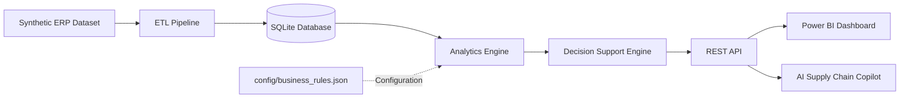

# AI Supply Chain Copilot

> 🚀 **Current Release:** **v0.5.0 — AI Layer Foundation**


<p align="center">
  
</p>

> **End-to-end Data Engineering and Decision Support platform with an AI-ready architecture for Supply Chain operations.**

An enterprise-inspired software engineering portfolio that combines **Supply Chain expertise, Data Engineering and Artificial Intelligence** to solve realistic inventory management problems using fully synthetic ERP data.

Rather than presenting isolated coding exercises, this repository evolves incrementally into a maintainable business application, demonstrating practical skills in software engineering, analytics, automation and AI.

---

# Table of Contents

- Overview
- Current Status
- Main Objectives
- Technology Stack
- Solution Architecture
- Project Structure
- Getting Started
- Automated Project Audit
- Engineering Practices
- Business Rules Configuration
- Development Workflow
- Roadmap
- Version History
- Current Development Stage
- Why this project?
- Repository Purpose
- License

---

# Overview

The objective of this project is to demonstrate how modern Supply Chain challenges can be addressed through software engineering and artificial intelligence.

The application simulates an enterprise inventory management environment, combining:

- Python
- ETL Pipelines
- SQLite
- Data Analytics
- Business Rules Engine
- AI-ready Architecture

All datasets are fully synthetic and inspired by real business processes, preserving corporate confidentiality while maintaining realistic operational scenarios.

---

# Current Status

| Module | Status |
|----------|--------|
| Project Architecture | ✅ |
| Synthetic ERP Dataset | ✅ |
| ETL Pipeline | ✅ |
| SQLite Database | ✅ |
| Inventory Analytics | ✅ |
| Business Rules Engine | ✅ |
| Configurable Business Rules | ✅ |
| Automated Project Audit | ✅ |
| SQL Analytics | ✅ |
| KPI Engine | ✅ |
| REST API | ✅ |
| Power BI Dashboard | ✅ |
| AI Layer Foundation | ✅ |
| Automated Test Suite | ✅ |
| Real LLM Integration | ⏳ |
| Cloud Deployment | ⏳ |

---

# Main Objectives

This repository demonstrates practical implementation of:

- Data Engineering
- Software Engineering
- AI-ready Architecture
- Supply Chain Analytics
- Business Process Automation
- Decision Support Systems

The focus is not simply learning Python syntax, but designing maintainable business software following professional engineering practices.

---

# Technology Stack

| Category | Technologies |
|----------|--------------|
| Language | Python 3.13 |
| Data Processing | Pandas |
| Database | SQLite |
| API Framework | FastAPI |
| AI Architecture | Modular AI Layer with Fake LLM Client |
| Business Intelligence | Power BI |
| Configuration | JSON |
| Version Control | Git / GitHub |
| IDE | Visual Studio Code |
| Documentation | Markdown |
| Automated Testing | Pytest |

### Planned Technologies

- PostgreSQL
- Docker
- Azure AI Services
- Large Language Models (LLMs)

---

# Solution Architecture



The solution adopts a layered and modular architecture in which each layer has a clearly defined responsibility and can evolve independently over time.

The **ETL Pipeline** extracts, validates, transforms and loads synthetic ERP data into the relational database, establishing a reliable data foundation for the application.

The **SQLite Database** serves as the persistence layer, storing standardized inventory data and supporting analytical queries.

The **Analytics Engine** retrieves persisted data and computes operational KPIs, inventory metrics, stockout risk indicators and prioritization scores based on configurable business parameters.

Business rules are externalized through the `config/business_rules.json` file, allowing operational thresholds and scoring parameters to evolve without modifying the application's source code.

The **Decision Support Engine** consolidates analytical outputs into actionable business recommendations, such as replenishment priorities, excess inventory identification and operational risk assessment.

The **REST API** exposes these analytical results to external consumers, enabling integration with Power BI dashboards and preparing the application for future AI-powered assistants.

The **AI Integration Layer** introduces a modular Copilot architecture composed of service orchestration, controlled data-access tools, structured context preparation, system prompting and an isolated LLM client.

The current implementation uses a simulated LLM client, allowing the complete application flow to be developed and tested without external API consumption. The architecture already includes explicit safeguards for future real-model integration, including controlled context size, response limits and deliberate activation of the real client.

This architecture promotes:

- Layered Architecture
- High Cohesion
- Low Coupling
- Single Responsibility Principle (SRP)
- Separation of Concerns
- Maintainability
- Testability
- Extensibility
- AI-ready System Design
---

# Project Structure

```text
AI-SUPPLY-CHAIN-COPILOT/

├── config/
│   └── business_rules.json
│
├── data/
├── database/
├── docs/
├── output/
├── sample_data/
├── scripts/
├── src/
├── tests/
│
├── README.md
├── requirements.txt
└── .gitignore
```

---

# Project Presentation

A comprehensive presentation describing the project's business case, software architecture, implementation strategy and development roadmap is available below.

### Downloads

- 📄 [Project Presentation (PDF)](docs/presentations/AI-Supply-Chain-Copilot.pdf)
- 📊 [Project Presentation (PowerPoint)](docs/presentations/AI-Supply-Chain-Copilot.pptx)

The presentation provides an executive overview of:

- Business Case
- Software Architecture
- ETL Pipeline
- Business Rules
- REST API
- Power BI Dashboard
- Engineering Decisions
- Development Roadmap
- Future AI Integration

---

# Getting Started

Clone the repository:

```bash
git clone <repository-url>
```

Install dependencies:

```bash
pip install -r requirements.txt
```

Run the inventory analysis:

```bash
python scripts/analyze_inventory.py
```

Generated output:

```text
output/inventory_analysis.csv
```

---

# Automated Project Audit

To ensure architectural consistency throughout development, the repository includes an automated engineering auditing tool.

Run:

```bash
python scripts/project_audit.py
```

The auditor automatically generates:

- Project Health Score
- Architecture Overview
- Pipeline Overview
- Python Module Inventory
- Function Catalog
- Dependency Analysis
- Repository Consistency Checks
- Syntax Validation
- Documentation Coverage
- TODO / FIXME Detection

Generated report:

```text
docs/project_audit/PROJECT_AUDIT.md
```

Rather than relying exclusively on manually maintained documentation, the project automatically generates engineering reports based on the current repository state, helping keep technical documentation aligned with the implementation.

---

# Engineering Practices

This project follows modern software engineering principles designed to maximize maintainability, extensibility and long-term evolution.

- Layered Architecture
- Modular Architecture
- High Cohesion
- Low Coupling
- Single Responsibility Principle (SRP)
- Separation of Concerns
- Configuration over Hardcoding
- Business-driven Development
- Synthetic Enterprise Dataset
- Continuous Refactoring
- Automated Project Audit
- Incremental Delivery
- Version Control
- AI-ready System Design
- Automated Testing with Pytest
- Controlled LLM Context
- Explicit LLM Activation Safeguards

---

# Business Rules Configuration

Business parameters are centralized in:

```text
config/business_rules.json
```

This configuration layer separates configurable business parameters from application code, allowing operational thresholds, scoring values and business policies to evolve without modifying Python source files.

By externalizing these parameters into a JSON configuration file, the project reduces hardcoded values, improves maintainability and enables business rule adjustments without requiring changes to the application's implementation.

Current configurable parameters include:

- Inventory limits
- Financial scoring thresholds
- ABC classification weights
- Stockout risk scoring
- Lead time scoring
- Priority thresholds

This architecture prepares the application for future administrative interfaces and REST APIs while keeping the core business logic modular and maintainable.

---

# Development Workflow

```text
Develop Feature
      │
      ▼
Execute Pipeline
      │
      ▼
Execute Project Audit
      │
      ▼
Review PROJECT_AUDIT.md
      │
      ▼
Commit
      │
      ▼
Push to GitHub
```

---

# Roadmap

| Phase | Planned Release | Status |
|---------|----------------|--------|
| Foundation (Architecture, Dataset, ETL, Database) | v0.1.0 | ✅ |
| Business Intelligence (Inventory Analytics, Rules Engine, Audit) | v0.2.0 | ✅ |
| Analytics (SQL Analytics, KPI Engine) | v0.3.0 | ✅ |
| Applications (REST API and Dashboard) | v0.4.0 | ✅ |
| AI Integration Layer | v0.5.0 | ✅ |
| Production Readiness (Cloud Deployment) | v1.0.0 | ⏳ |

---

# Version History

| Version | Highlights |
|-----------|------------|
| **v0.1.0** | Project architecture, synthetic ERP dataset and repository foundation |
| **v0.2.0** | ETL Pipeline, SQLite integration, Inventory Analytics MVP, Business Rules Configuration, Configurable Business Rules and Automated Project Audit |
| **v0.3.0** | SQL Analytics, KPI Engine and advanced business metrics |
| **v0.4.0** | REST API, Dashboard and application layer |
| **v0.5.0** | AI Layer Foundation
| **v1.0.0 (Target)** | AI Copilot, cloud deployment and production-ready architecture |

---

# Current Development Stage

The project has completed the AI Layer Foundation, including the Copilot API endpoint, modular AI orchestration, controlled context preparation, system prompting, simulated LLM integration, explicit cost safeguards and an automated test suite.

The current implementation has been validated with 37 automated tests and remains intentionally isolated from paid LLM providers. The next development stage is the controlled integration and validation of a real Large Language Model before progressing toward production readiness and cloud deployment.

---

# Why this project?

This repository reflects my transition from Supply Chain leadership to Artificial Intelligence and Software Engineering.

It combines nearly two decades of enterprise experience solving operational challenges with modern software development practices, using synthetic enterprise data to preserve confidentiality while demonstrating realistic business scenarios.

The objective is not only to build software, but to demonstrate the ability to design maintainable business solutions that integrate engineering, analytics and artificial intelligence.

---

# Repository Purpose

This repository serves as a long-term engineering portfolio focused on building an end-to-end Supply Chain application rather than isolated coding exercises.

Each sprint delivers a production-inspired capability while preserving architecture quality, maintainability and long-term scalability.

---

# License

This repository is intended exclusively for educational and portfolio purposes.

All datasets, business rules and operational scenarios are fictional or synthetically generated and do not contain confidential corporate information.