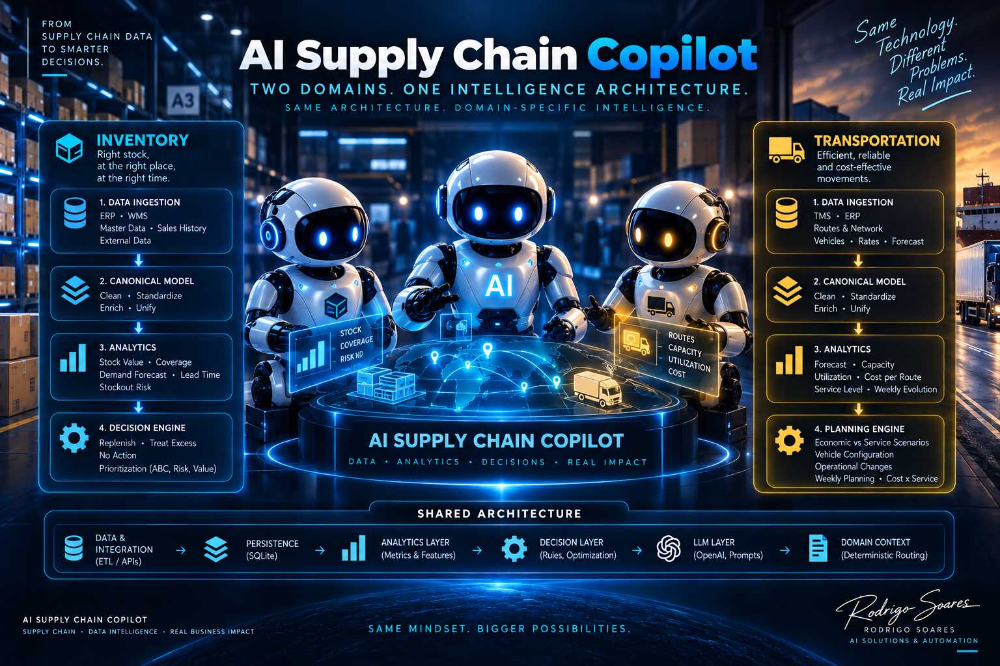
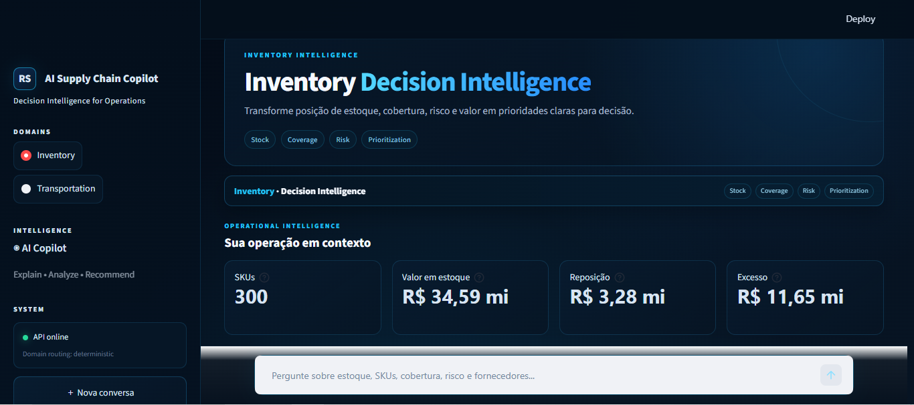
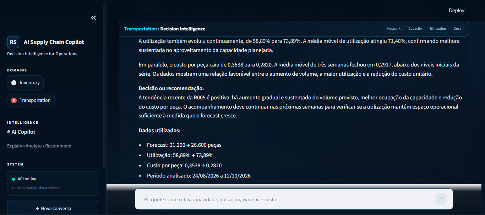
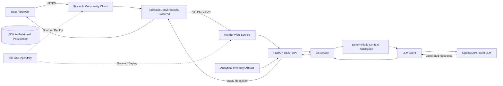

# AI Supply Chain Copilot

🚀 **Current Release:** v2.0.0 — Multi-Domain Decision Intelligence  
🌐 **Live Demo:** Open AI Supply Chain Copilot

<p align="center">
  
</p>

> **Two operational domains. One shared intelligence architecture.**  
> Deterministic analytics first; Generative AI where interpretation adds value.

The AI Supply Chain Copilot is an end-to-end decision-support platform that turns synthetic operational data into deterministic analytics, business decisions and natural-language explanations.

The current release demonstrates two materially different Supply Chain domains — **Inventory** and **Transportation** — running through the same application foundation while preserving domain-specific data, metrics and decision logic.

## The Core Idea

The project is built around a simple architectural principle:

> **Shared infrastructure. Domain-specific intelligence.**

**Inventory Decision Intelligence** focuses on stock value, coverage, stockout risk, ABC classification, replenishment, excess treatment and prioritization.

**Transportation Decision Intelligence** focuses on forecast, route capacity, vehicle configuration, utilization, cost per route, service-level trade-offs, operational changes and weekly planning.

The user selects the domain explicitly in the frontend. The backend routes the request deterministically to the correct analytical context. The LLM is not used to guess a domain that the user has already selected, reducing unnecessary token consumption, complexity and routing ambiguity.

<p align="center">
  
</p>

## Product Experience

The architecture is implemented as a working multi-domain application rather than only as a diagram.

The Streamlit frontend exposes Inventory and Transportation as explicit operational domains, preserves their visual identity during navigation and connects both experiences to the same FastAPI and AI foundations.

### Inventory Decision Intelligence

Inventory presents consolidated operational context and lets the user investigate priorities, stockout exposure, critical SKUs, suppliers, coverage and recommended actions.

<p align="center">
  
</p>

### Transportation Decision Intelligence

Transportation reuses the same product shell while exposing a different analytical context: network, capacity, utilization, route cost, operational changes and economic-versus-service planning scenarios.

<p align="center">
  
</p>

> **The frontend changes context; the architecture remains shared.**

## Engineering at a Glance

| Layer | Implementation |
| --- | --- |
| Data | Synthetic ERP / operational datasets |
| ETL & Integration | Python, Pandas |
| Persistence | SQLite |
| Inventory Intelligence | KPIs, coverage, risk, ABC, prioritization, deterministic actions |
| Transportation Intelligence | SQL analytics, capacity, utilization, cost and planning scenarios |
| Decision Layer | Rules, thresholds, optimization and planning policies |
| API | FastAPI |
| AI Layer | OpenAI / LLM with controlled domain context |
| Domain Routing | Explicit frontend selection + deterministic backend routing |
| Frontend | Streamlit |
| BI | Power BI / analytical artifacts |
| Validation | Pytest + real-LLM golden-set evaluation |
| **Current Baseline** | **105 automated tests passing** |

## Table of Contents

- [The Core Idea](#the-core-idea)
- [Product Experience](#product-experience)
- [Engineering at a Glance](#engineering-at-a-glance)
- [Overview](#overview)
- [Current Status](#current-status)
- [Technology Stack](#technology-stack)
- [Solution Architecture](#solution-architecture)
- [AI Copilot](#ai-copilot)
- [Project Structure](#project-structure)
- [Project Presentation](#project-presentation)
- [Getting Started](#getting-started--local-development)
- [Automated Tests](#automated-tests)
- [Engineering Practices](#engineering-practices)
- [Roadmap & Version History](#roadmap--version-history)
- [Current Development Stage](#current-development-stage)
- [Why this project?](#why-this-project)
- [License](#license)

## Overview

The objective of this project is to demonstrate how modern Supply Chain problems can be addressed through software engineering, deterministic analytics and artificial intelligence.

Rather than building isolated coding exercises, the repository evolved into a modular business application with:

- Python and Pandas data pipelines
- SQLite persistence
- Inventory analytics and deterministic decision rules
- Transportation SQL analytics and planning logic
- FastAPI endpoints
- Streamlit multi-domain frontend
- Power BI / analytical artifacts
- Real LLM integration
- Domain-specific AI contexts
- Automated tests and project audit
- Public cloud deployment

All operational datasets are synthetic and inspired by realistic business processes, preserving corporate confidentiality while supporting meaningful analytical scenarios.

The v2.0.0 release is intentionally multi-domain: Inventory and Transportation solve different operational problems without becoming separate products.

## Current Status

| Module | Status |
| --- | :---: |
| Project Architecture | ✅ |
| Synthetic ERP Dataset | ✅ |
| ETL Pipeline | ✅ |
| SQLite Database | ✅ |
| Inventory Analytics | ✅ |
| Business Rules Engine | ✅ |
| Configurable Business Rules | ✅ |
| Automated Project Audit | ✅ |
| SQL Analytics | ✅ |
| KPI Engine | ✅ |
| REST API | ✅ |
| Power BI Dashboard | ✅ |
| AI Layer Foundation | ✅ |
| Automated Test Suite | ✅ |
| Real LLM Integration | ✅ |
| Real LLM Golden Set Validation | ✅ |
| Multi-Model Benchmark | ✅ |
| LLM Cost / Activation Safeguards | ✅ |
| Streamlit Conversational Frontend | ✅ |
| Public Cloud Deployment | ✅ |
| End-to-End Cloud Integration | ✅ |
| Transportation Data Model | ✅ |
| Transportation SQL Analytics | ✅ |
| Economic vs Service Planning Scenarios | ✅ |
| Deterministic Domain Routing | ✅ |
| Domain-Specific AI Contexts | ✅ |
| Transportation Real-LLM Golden Set Validation | ✅ |
| Multi-Domain Streamlit UX | ✅ |

### Main Objectives

This repository demonstrates practical implementation of:

- Data Engineering
- Software Engineering
- AI-enabled Solution Architecture
- Supply Chain Analytics
- Business Process Automation
- Decision Support Systems

The focus is not simply learning Python syntax, but designing maintainable business software following professional engineering practices.

## Technology Stack

| Category | Technologies |
| --- | --- |
| Language | Python 3.14 |
| Data Processing | Pandas |
| Database | SQLite |
| API Framework | FastAPI |
| Business Intelligence | Power BI |
| Business Rules Configuration | JSON |
| Version Control | Git / GitHub |
| IDE | Visual Studio Code |
| Documentation | Markdown |
| Automated Testing | Pytest |
| AI Integration | OpenAI API / Large Language Model |
| AI Architecture | Modular AI Layer with Real and Fake LLM Clients |
| Frontend | Streamlit |
| Backend Hosting | Render |
| Frontend Hosting | Streamlit Community Cloud |
| Cloud Configuration | Environment Variables / Secrets |


## Solution Architecture

The v2.0.0 architecture separates shared platform capabilities from domain-specific analytical intelligence. Inventory and Transportation use different data, metrics and decision logic, but converge on the same persistence, API, AI and frontend foundations.

The high-level architecture diagram at the top of this README is the canonical visual summary of the current release. The sections below explain the domain boundaries and shared layers in more detail.

### Domain architecture

Inventory transforms synthetic ERP inventory data into deterministic KPIs, coverage, risk, prioritization and actions such as `REPOR`, `TRATAR EXCESSO` and `SEM AÇÃO`. Exact calculations and aggregations remain outside the LLM.

Transportation extends the platform with a relational transportation model and SQL-driven analytics. It evaluates weekly forecast, route profiles, vehicle capacity, utilization, trip requirements, cost and economic vs service planning scenarios.

### Deterministic domain routing

Domain selection is explicit in the frontend. The backend receives the selected domain and routes the request to the corresponding context and capabilities. This is intentionally deterministic: the LLM does not spend tokens deciding whether a question belongs to Inventory or Transportation when the user has already made that choice.

### Shared architecture

Both domains reuse the same architectural backbone:

```text
Data & Integration → Persistence → Analytics → Decision/Planning → Domain Context → FastAPI → AI Copilot → Streamlit
```

This promotes modularity, reuse and extensibility while allowing each domain to preserve its own business semantics. The Copilot is therefore not the decision engine itself: deterministic application layers calculate what can be calculated exactly, while the LLM explains, synthesizes and communicates the supplied context.

The architecture promotes layered design, high cohesion, low coupling, separation of concerns, deterministic/probabilistic separation, testability, controlled LLM context and cost-aware AI usage.

### Cloud Deployment Architecture

The application is deployed as a distributed cloud solution while preserving the same layered architecture used during local development.



### Environment-based configuration

The same source code supports both local and cloud execution through environment-specific configuration.

| Configuration | Local | Cloud |
| --- | --- | --- |
| Frontend API Base URL | `http://127.0.0.1:8000` | Render public backend URL |
| LLM Mode | configurable | `real` |
| Real LLM Enabled | configurable | `true` |
| OpenAI API Key | local environment variable | backend secret |

Application code, runtime configuration and secrets are deliberately separated.

The `OPENAI_API_KEY` is never stored in source code or exposed to the Streamlit frontend.

Detailed cloud deployment architecture, service responsibilities, runtime configuration and deployment decisions are documented in:

`docs/architecture/05_cloud_deployment.md`

## AI Copilot

The AI Supply Chain Copilot is the natural-language decision-support layer shared by both operational domains. It does not replace the deterministic analytics or planning engines. Instead, it receives structured domain context and uses the LLM for interpretation, synthesis and communication.

### Domain-aware interaction

The user first selects Inventory or Transportation in the Streamlit interface. That explicit selection becomes part of the API request and deterministically activates the appropriate domain context.

#### Inventory context

Supports questions about stock position, SKUs, coverage, stockout risk, priorities, recommended inventory actions and supplier exposure. The context combines detailed selected records with consolidated indicators so the model can distinguish sample-level evidence from the complete analytical universe.

#### Transportation context

Supports questions about routes, forecast, capacity, vehicle choice, trip frequency, utilization, cost, recent evolution, operational changes and economic-versus-service scenarios. SQL analytics provide the deterministic evidence before the LLM interprets it.

### Controlled AI workflow

```text
User selects domain
        ↓
Streamlit sends question + explicit domain
        ↓
FastAPI validates and routes deterministically
        ↓
Domain analytics / SQL / decision logic
        ↓
Domain-specific structured context
        ↓
LLM Client / OpenAI
        ↓
Grounded natural-language explanation
        ↓
FastAPI → Streamlit → User
```

The core rule is **Context ≠ Policy**. Context informs the LLM; critical calculations and operational rules remain deterministic and auditable. The model should explain what the supplied data supports rather than invent missing causes.

### Fake and Real LLM Modes

The LLM client supports both **Fake LLM** for cost-free deterministic development/testing and **Real LLM** for controlled end-to-end validation through OpenAI. Real calls require explicit environment activation and a valid API key. Context size and response size are controlled to reduce unnecessary token consumption.

### API contract

The Copilot is exposed through the REST API. The multi-domain contract carries both the natural-language question and the explicitly selected domain, allowing the backend to choose the correct context without probabilistic intent classification.

### Real LLM validation

Inventory and Transportation have been validated against real LLM behavior using structured evaluation cases. A key architectural lesson from the Inventory validation was to move exact aggregation, extrema and tie handling into deterministic context preparation instead of relying on probabilistic recalculation.

Transportation validation extends the same principle to SQL-backed analytical questions and planning scenarios. Evaluation evidence is stored under `docs/evaluations/`, including the Inventory model benchmark and `Transportation_Real_LLM_Golden_Set_Validation.xlsx`.

The automated regression suite currently passes **105 tests**. Real-LLM evaluation is kept separate from routine deterministic tests so normal development remains repeatable and cost-efficient.

### Cloud end-to-end flow

```text
User → Streamlit → explicit domain → FastAPI → domain analytics/context → LLM Client → OpenAI → FastAPI → Streamlit → User
```

## Project Structure

```text
AI-SUPPLY-CHAIN-COPILOT/
├── config/
│   └── business_rules.json
│
├── data/
├── database/
│
├── docs/
│   ├── architecture/
│   │   ├── 01_system_overview.md
│   │   ├── 02_current_architecture.md
│   │   ├── 03_data_model.md
│   │   ├── 04_decision_log.md
│   │   ├── 05_cloud_deployment.md
│   │   └── 06_transportation_architecture.md
│   │
│   ├── evaluations/
│   │   ├── LLM_Real_Model_Benchmark_Final.xlsx
│   │   └── Transportation_Real_LLM_Golden_Set_Validation.xlsx
│   ├── images/
│   ├── presentations/
│   ├── project_audit/
│   └── roadmap/
│
├── frontend/
│   └── app.py
│
├── output/
├── reports/
├── sample_data/
├── scripts/
│
├── src/
│   ├── ai/
│   │   ├── client.py
│   │   ├── inventory_context.py
│   │   ├── transportation_context.py
│   │   ├── transportation_router.py
│   │   ├── prompts.py
│   │   ├── service.py
│   │   └── tools.py
│   └── api/
│
├── tests/
│   ├── golden_test_set.md
│   ├── test_ai_client.py
│   ├── test_ai_context.py
│   ├── test_ai_service.py
│   ├── test_ai_tools.py
│   └── test_api_copilot.py
│
├── README.md
├── requirements.txt
└── .gitignore
```

## Project Presentation

The repository contains both technical documentation and visual material. The README intentionally uses only the visuals that represent the current v2.0.0 multi-domain architecture and implemented product experience, keeping older single-domain or future-state concepts out of the main narrative.

A comprehensive presentation describing the project's business case, software architecture, implementation strategy and development roadmap is available below.

### Downloads

- 📄 Project Presentation (PDF)
- 📊 Project Presentation (PowerPoint)

The presentation provides an executive overview of:

- Business Case
- Software Architecture
- ETL Pipeline
- Business Rules
- REST API
- Power BI Dashboard
- Engineering Decisions
- Development Roadmap
- AI Integration Roadmap

## Getting Started — Local Development

The steps below describe how to run the complete application locally.

For direct access to the deployed version, use the Live Demo available at the top of this README.

### 1. Clone the repository

```powershell
git clone https://github.com/RodsSoares/ai-supply-chain-copilot.git
cd ai-supply-chain-copilot
```

### 2. Create and activate a virtual environment

```powershell
python -m venv .venv
.\.venv\Scripts\Activate.ps1
```

### 3. Install dependencies

```powershell
pip install -r requirements.txt
```

### 4. Run the deterministic Inventory pipeline

```powershell
python scripts/analyze_inventory.py
```

This executes the deterministic Supply Chain pipeline and generates the analytical outputs consumed by the application.

### 5. Choose the LLM execution mode

The Copilot supports both Fake LLM and Real LLM execution modes.

#### Fake LLM Mode

Recommended for local development, testing and demonstrations that do not require external API consumption.

```powershell
$env:LLM_MODE="fake"
```

#### Real LLM Mode

To enable the real LLM integration, configure the required environment variables:

```powershell
$env:OPENAI_API_KEY="your-api-key"
$env:LLM_MODE="real"
$env:LLM_REAL_ENABLED="true"
```

> **Security:** Never commit API keys, credentials or other secrets to the repository. Environment variables should be configured only in the local execution environment or through an appropriate secrets-management solution.

> **Cost control:** Real LLM calls consume external API resources and may generate costs. The `LLM_REAL_ENABLED` variable acts as an explicit safeguard so that selecting real mode alone does not automatically authorize external model calls.

### 6. Start the REST API

```powershell
python -m uvicorn src.api.main:app
```

After startup, the interactive API documentation is available at:

`http://127.0.0.1:8000/docs`

### 7. Test the Copilot

Through the Swagger interface, execute:

`POST /copilot`

Example request:

```json
{
  "pergunta": "Quais produtos apresentam prioridade alta?"
}
```

In Fake LLM Mode, the application validates the complete internal AI flow without calling an external provider.

In Real LLM Mode, the request is processed through the complete application pipeline and sent to the configured external LLM provider.

### 8. Run the automated test suite

```powershell
python -m pytest
```

The automated tests validate the deterministic modules, API behavior, AI orchestration, context controls and LLM client safeguards.

### 9. Start the Streamlit Frontend

#### Frontend API Configuration

The Streamlit frontend communicates with the FastAPI backend through the `API_BASE_URL` environment variable.

For local execution:

```powershell
$env:API_BASE_URL="http://127.0.0.1:8000"
```

In cloud environments, `API_BASE_URL` should point to the deployed FastAPI backend.

If the variable is not defined, the application defaults to the local API address.

With the REST API running, start the conversational frontend in a second terminal:

```powershell
python -m streamlit run frontend/app.py
```

## Automated Tests

The project uses Pytest as a regression safety net across deterministic analytics, APIs and AI integration. The current v2.0.0 baseline is:

```text
105 passed in 6.29s
```

Coverage includes Inventory and Transportation analytics, AI client modes and safeguards, domain-specific context preparation, deterministic domain routing, transportation SQL analysis, Copilot API behavior, integration between API and AI layers, and error/external-call protection.

Run the complete suite from the project root:

```powershell
python -m pytest
```

Routine automated tests remain deterministic and avoid unnecessary real-LLM consumption. Real model behavior is validated separately through controlled Golden Set executions.

### Automated Project Audit

To ensure architectural consistency throughout development, the repository includes an automated engineering auditing tool.

Run:

```powershell
python scripts/project_audit.py
```

The auditor automatically generates:

- Project Health Score
- Architecture Overview
- Pipeline Overview
- Python Module Inventory
- Function Catalog
- Dependency Analysis
- Repository Consistency Checks
- Syntax Validation
- Documentation Coverage
- TODO / FIXME Detection

Generated report:

`docs/project_audit/PROJECT_AUDIT.md`

Rather than relying exclusively on manually maintained documentation, the project automatically generates engineering reports based on the current repository state, helping keep technical documentation aligned with the implementation.

## Engineering Practices

This project follows modern software engineering principles designed to maximize maintainability, extensibility and long-term evolution.

- Layered Architecture
- Modular Architecture
- High Cohesion
- Low Coupling
- Single Responsibility Principle (SRP)
- Separation of Concerns
- Configuration over Hardcoding
- Environment-based Runtime Configuration
- Business-driven Development
- Synthetic Enterprise Dataset
- Continuous Refactoring
- Automated Project Audit
- Incremental Delivery
- Version Control
- Automated Testing with Pytest
- Deterministic / Probabilistic Layer Separation
- Modular AI Integration
- Explicit LLM Activation Safeguards
- Controlled LLM Context
- Fake Client for Cost-free Testing

### Business Rules Configuration

Business parameters are centralized in:

`config/business_rules.json`

This configuration layer separates configurable business parameters from application code, allowing operational thresholds, scoring values and business policies to evolve without modifying Python source files.

By externalizing these parameters into a JSON configuration file, the project reduces hardcoded values, improves maintainability and enables business rule adjustments without requiring changes to the application's implementation.

Current configurable parameters include:

- Inventory limits
- Financial scoring thresholds
- ABC classification weights
- Stockout risk scoring
- Lead time scoring
- Priority thresholds

This architecture supports future administrative interfaces and additional API-based configuration capabilities while keeping the core business logic modular and maintainable.

### Development Workflow

```text
Develop Feature
      │
      ▼
Execute Pipeline
      │
      ▼
Run Automated Tests
      │
      ▼
Execute Project Audit
      │
      ▼
Review PROJECT_AUDIT.md
      │
      ▼
Commit
      │
      ▼
Push to GitHub
      │
      ▼
Cloud Deployment
      │
      ▼
End-to-End Validation
```

## Roadmap & Version History

| Phase | Planned Release | Status |
| --- | --- | :---: |
| Foundation (Architecture, Dataset, ETL, Database) | v0.1.0 | ✅ |
| Business Intelligence (Inventory Analytics, Rules Engine, Audit) | v0.2.0 | ✅ |
| Analytics (SQL Analytics, KPI Engine) | v0.3.0 | ✅ |
| Applications (REST API and Dashboard) | v0.4.0 | ✅ |
| AI Integration Layer | v0.5.0 | ✅ |
| Functional AI Copilot | v1.0.0 | ✅ |
| Cloud Deployment & Conversational Frontend | v1.1.0 | ✅ |
| Multi-Domain Architecture: Inventory + Transportation | v2.0.0 | ✅ |
| Production Hardening / Agentic Execution | Future | ⏳ |

### Version History

| Version | Highlights |
| --- | --- |
| v0.1.0 | Project architecture, synthetic ERP dataset and repository foundation |
| v0.2.0 | ETL Pipeline, SQLite integration, Inventory Analytics MVP, Business Rules Configuration, Configurable Business Rules and Automated Project Audit |
| v0.3.0 | SQL Analytics, KPI Engine and advanced business metrics |
| v0.4.0 | REST API, Dashboard and application layer |
| v0.5.0 | AI Layer Foundation |
| v1.0.0 | Functional AI Copilot with validated real LLM integration, controlled context, explicit activation safeguards and end-to-end API flow |
| v1.1.0 | Streamlit conversational frontend, public cloud deployment, Render-hosted FastAPI backend, Streamlit Community Cloud frontend, environment-based service configuration and validated end-to-end cloud integration |
| v2.0.0 | Multi-domain architecture with Inventory and Transportation, deterministic domain routing, transportation SQL analytics and planning scenarios, domain-specific AI context, redesigned decision-intelligence frontend, real-LLM transportation validation and 105 passing automated tests |

## Current Development Stage

The AI Supply Chain Copilot v2.0.0 has reached the intended scope of its current public portfolio stage.

The project now demonstrates two materially different Supply Chain domains — Inventory and Transportation — running through one modular intelligence architecture. Inventory emphasizes risk, prioritization and recommended stock actions; Transportation emphasizes SQL analytics, capacity/cost trade-offs and planning scenarios.

The frontend exposes the domains explicitly, the backend routes them deterministically, each domain prepares its own analytical context, and the shared Copilot layer uses Generative AI to explain and synthesize evidence produced by deterministic application components.

The current baseline includes a redesigned multi-domain Streamlit experience, FastAPI integration, real-LLM validation, updated architecture documentation and **105 passing automated tests**.

This is intentionally a portfolio and learning system, not a production enterprise implementation. Authentication, authorization, enterprise observability, persistent production infrastructure and proactive agentic execution are therefore not prerequisites for closing this stage. They remain legitimate future evolution paths rather than missing requirements for the current objective.

A possible future direction is **Decision Support → Agentic Execution**, adding action policies, human approval, audit logs and controlled execution against external systems. That evolution should only be introduced when it serves a concrete use case rather than to add architectural complexity for its own sake.

## Why this project?

This repository reflects my transition from Supply Chain leadership toward AI Solutions, Intelligent Automation and AI Transformation.

It combines nearly two decades of enterprise experience in Supply Chain, Planning and Operations with data, automation, software architecture and Generative AI.

The objective is not only to build software, but to demonstrate the ability to design maintainable business solutions that integrate engineering, analytics and artificial intelligence.

### Repository Purpose

This repository serves as a functional AI Solutions portfolio project demonstrating the end-to-end design, implementation and cloud deployment of a business application integrating data engineering, analytics, business rules, APIs, Business Intelligence and Generative AI.

Each sprint delivers an enterprise-inspired capability while preserving architecture quality, maintainability and long-term scalability.

## License

This repository is intended exclusively for educational and portfolio purposes.

All datasets, business rules and operational scenarios are fictional or synthetically generated and do not contain confidential corporate information.
