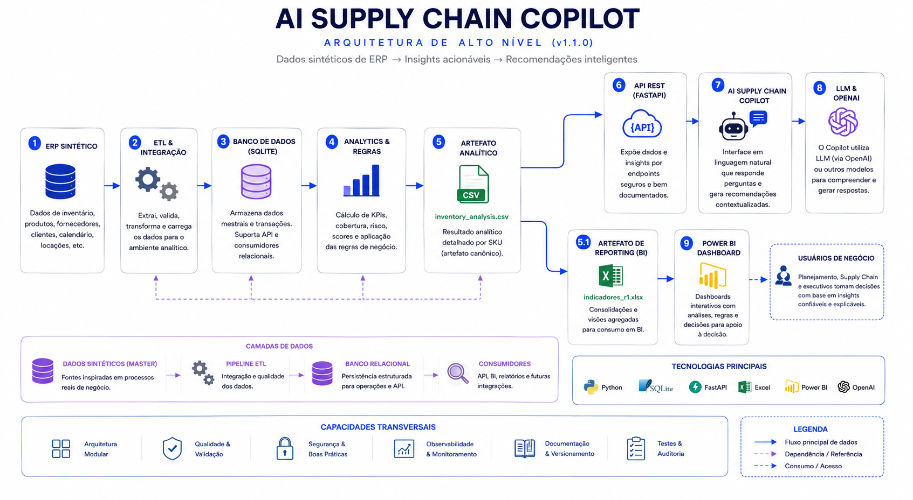
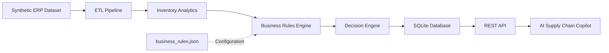

# AI Supply Chain Copilot

> 🚀 **Current Release:** **v0.2.0 — Business Intelligence Foundation Completed**


<p align="center">
  
</p>

> **End-to-end AI, Data Engineering and Decision Support platform for Supply Chain operations.**

An enterprise-inspired software engineering portfolio that combines **Supply Chain expertise, Data Engineering and Artificial Intelligence** to solve realistic inventory management problems using fully synthetic ERP data.

Rather than presenting isolated coding exercises, this repository evolves incrementally into a maintainable business application, demonstrating practical skills in software engineering, analytics, automation and AI.

---

# Table of Contents

- Overview
- Current Status
- Main Objectives
- Technology Stack
- High-Level Architecture
- Project Structure
- Getting Started
- Automated Project Audit
- Engineering Practices
- Business Rules Configuration
- Development Workflow
- Roadmap
- Version History
- Current Development Stage
- Why this project?
- Repository Purpose
- License

---

# Overview

The objective of this project is to demonstrate how modern Supply Chain challenges can be addressed through software engineering and artificial intelligence.

The application simulates an enterprise inventory management environment, combining:

- Python
- ETL Pipelines
- SQLite
- Data Analytics
- Business Rules Engine
- AI-ready Architecture

All datasets are fully synthetic and inspired by real business processes, preserving corporate confidentiality while maintaining realistic operational scenarios.

---

# Current Status

| Module | Status |
|----------|--------|
| Project Architecture | ✅ |
| Synthetic ERP Dataset | ✅ |
| ETL Pipeline | ✅ |
| SQLite Database | ✅ |
| Inventory Analytics | ✅ |
| Business Rules Engine | ✅ |
| Configurable Business Rules | ✅ |
| Automated Project Audit | ✅ |
| SQL Analytics | 🚧 |
| KPI Engine | 🚧 |
| REST API | ⏳ |
| Dashboard | ⏳ |
| AI Copilot | ⏳ |
| Cloud Deployment | ⏳ |

---

# Main Objectives

This repository demonstrates practical implementation of:

- Data Engineering
- Software Engineering
- AI-ready Architecture
- Supply Chain Analytics
- Business Process Automation
- Decision Support Systems

The focus is not simply learning Python syntax, but designing maintainable business software following professional engineering practices.

---

# Technology Stack

| Category | Technologies |
|----------|--------------|
| Language | Python |
| Data Processing | Pandas |
| Configuration | JSON |
| Database | SQLite |
| Version Control | Git / GitHub |
| IDE | Visual Studio Code |
| Documentation | Markdown |

### Planned Technologies

- FastAPI
- PostgreSQL
- Docker
- Power BI
- Azure AI Services
- Large Language Models (LLMs)

---

# High-Level Architecture



---

# Project Structure

```text
AI-SUPPLY-CHAIN-COPILOT/

├── config/
│   └── business_rules.json
│
├── data/
├── database/
├── docs/
├── output/
├── sample_data/
├── scripts/
├── src/
├── tests/
│
├── README.md
├── requirements.txt
└── .gitignore
```

---

# Getting Started

Clone the repository:

```bash
git clone <repository-url>
```

Install dependencies:

```bash
pip install -r requirements.txt
```

Run the inventory analysis:

```bash
python scripts/analyze_inventory.py
```

Generated output:

```text
output/inventory_analysis.csv
```

---

# Automated Project Audit

To ensure architectural consistency throughout development, the repository includes an automated engineering auditing tool.

Run:

```bash
python scripts/project_audit.py
```

The auditor automatically generates:

- Project Health Score
- Architecture Overview
- Pipeline Overview
- Python Module Inventory
- Function Catalog
- Dependency Analysis
- Repository Consistency Checks
- Syntax Validation
- Documentation Coverage
- TODO / FIXME Detection

Generated report:

```text
docs/project_audit/PROJECT_AUDIT.md
```

Instead of relying exclusively on manually maintained documentation, the project continuously documents itself through automated analysis, helping keep implementation and documentation synchronized.

---

# Engineering Practices

This project follows engineering principles focused on maintainability and long-term evolution.

- Modular Architecture
- Separation of Responsibilities
- Configuration over Hardcoding
- Business-driven Development
- Synthetic Enterprise Dataset
- Continuous Refactoring
- Automated Project Audit
- Incremental Delivery
- Version Control
- AI-ready Design

---

# Business Rules Configuration

Business parameters are centralized in:

```text
config/business_rules.json
```

This configuration layer separates business logic from application code, allowing operational thresholds and scoring rules to evolve without modifying Python source files.

Current configurable parameters include:

- Inventory limits
- Financial scoring thresholds
- ABC classification weights
- Stockout risk scoring
- Lead time scoring
- Priority thresholds

This architecture prepares the application for future administrative interfaces and REST APIs while keeping the core business logic modular and maintainable.

---

# Development Workflow

```text
Develop Feature
      │
      ▼
Execute Pipeline
      │
      ▼
Execute Project Audit
      │
      ▼
Review PROJECT_AUDIT.md
      │
      ▼
Commit
      │
      ▼
Push to GitHub
```

---

# Roadmap

| Phase | Planned Release | Status |
|---------|----------------|--------|
| Foundation (Architecture, Dataset, ETL, Database) | v0.1.0 | ✅ |
| Business Intelligence (Inventory Analytics, Rules Engine, Audit) | v0.2.0 | ✅ |
| Analytics (SQL Analytics, KPI Engine) | v0.3.0 | 🚧 |
| Applications (REST API, Dashboard, AI Copilot) | v0.4.x | ⏳ |
| Production Readiness (Cloud Deployment) | v1.0.0 | ⏳ |

---

# Version History

| Version | Highlights |
|-----------|------------|
| **v0.1.0** | Project architecture, synthetic ERP dataset and repository foundation |
| **v0.2.0** | ETL Pipeline, SQLite integration, Inventory Analytics MVP, Business Rules Engine, Configurable Business Rules and Automated Project Audit |
| **v0.3.0 (Planned)** | SQL Analytics, KPI Engine and advanced business metrics |
| **v0.4.x (Planned)** | REST API, Dashboard and application layer |
| **v1.0.0 (Target)** | AI Copilot, cloud deployment and production-ready architecture |

---

# Current Development Stage

The project has completed its **Business Intelligence Foundation (v0.2.0)** and is now entering the **Analytics phase**, focused on SQL-based insights, KPI generation and advanced decision support capabilities.

---

# Why this project?

This repository reflects my transition from Supply Chain leadership to Artificial Intelligence and Software Engineering.

It combines nearly two decades of enterprise experience solving operational challenges with modern software development practices, using synthetic enterprise data to preserve confidentiality while demonstrating realistic business scenarios.

The objective is not only to build software, but to demonstrate the ability to design maintainable business solutions that integrate engineering, analytics and artificial intelligence.

---

# Repository Purpose

This repository serves as a long-term engineering portfolio focused on building an end-to-end Supply Chain application rather than isolated coding exercises.

Each sprint delivers a production-inspired capability while preserving architecture quality, maintainability and long-term scalability.

---

# License

This repository is intended exclusively for educational and portfolio purposes.

All datasets, business rules and operational scenarios are fictional or synthetically generated and do not contain confidential corporate information.