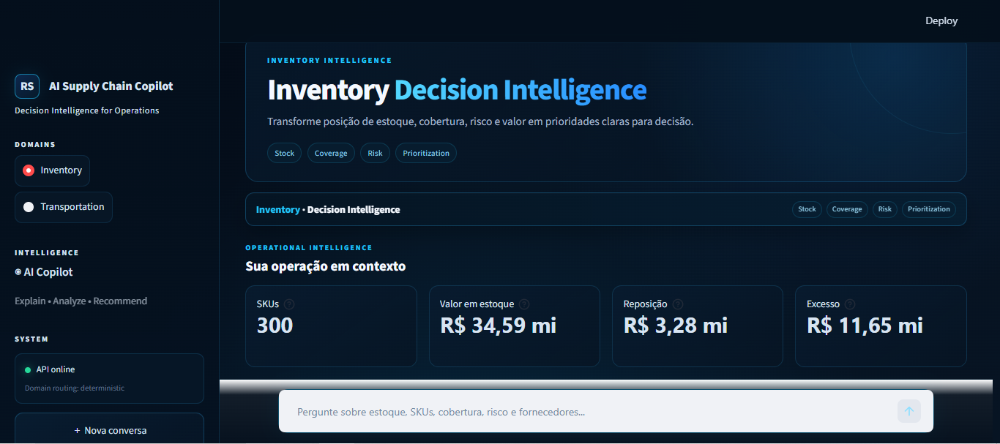
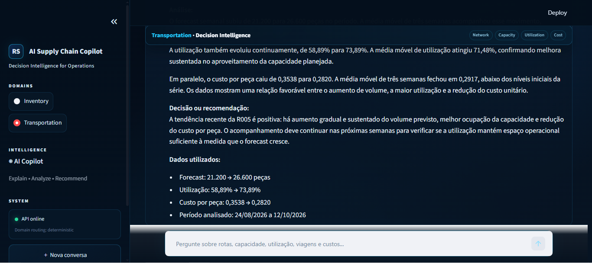
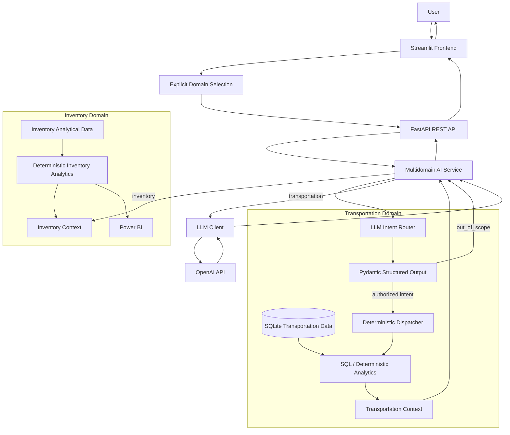

# AI Supply Chain Copilot

🚀 **Current Release:** v2.0.0 — Multi-Domain Decision Intelligence  
🌐 **Live Demo:** Open AI Supply Chain Copilot

<p align="center">


</p>

> **From operational data to decision-ready intelligence.**  
> Deterministic analytics establish the facts. Generative AI interprets and communicates them. The human owns the decision.

**AI Supply Chain Copilot** is an end-to-end decision-support application that combines **Supply Chain domain knowledge, data engineering, SQL analytics, deterministic business logic, APIs, Business Intelligence and Generative AI** in one modular architecture.

The current release supports two materially different operational domains — **Inventory** and **Transportation** — through a shared application foundation while preserving domain-specific data, metrics, rules and analytical behavior.

This is not an LLM wrapped around a dataset. The application deliberately separates **authoritative business computation** from **probabilistic interpretation**.

``` text
Operational Data
      ↓
Deterministic Analytics
      ↓
Business Facts / Scenarios
      ↓
Controlled AI Context
      ↓
LLM Interpretation
      ↓
Decision Support
      ↓
Human Decision
```

## What This Project Demonstrates

The project was built as a portfolio-grade business system rather than a collection of isolated coding exercises.

It demonstrates the ability to connect:

| Capability                | Evidence in the project                                               |
|:--------------------------|:----------------------------------------------------------------------|
| **Supply Chain**          | Inventory and Transportation decision-support domains                 |
| **Data Engineering**      | Synthetic ERP-style data, ETL, standardization and persistence        |
| **SQL & Analytics**       | Deterministic KPI calculation and Transportation analytical queries   |
| **Decision Intelligence** | Rules, thresholds, classifications, scenarios and recommended actions |
| **Software Architecture** | Modular layers, explicit contracts and separation of responsibilities |
| **API Integration**       | FastAPI REST interface between application layers                     |
| **Business Intelligence** | Power BI and analytical artifacts                                     |
| **AI Solutions**          | Controlled LLM context, structured routing and grounded explanations  |
| **Automation**            | End-to-end analytical and conversational workflows                    |
| **Validation**            | Pytest regression suite plus structured real-LLM evaluation           |
| **Cloud**                 | Independently deployed frontend and backend services                  |

**Current engineering baseline: 105 automated tests passing.**

## The Business Problem

Operational teams rarely lack data. The harder problem is transforming fragmented operational information into **reliable, decision-ready context**.

Inventory planners need to understand stock exposure, coverage, stockout risk, excess, priorities and recommended actions.

Transportation planners need to understand forecast demand, route capacity, vehicle configuration, utilization, required trips, transportation cost and the trade-off between service frequency and unit economics.

The Copilot addresses those problems through a hybrid architecture:

> **Application code establishes the facts. AI helps humans interpret the facts.**

Exact calculations, aggregations, classifications and business rules remain under deterministic application control. The LLM is used where language and semantic interpretation add value: understanding bounded intent, synthesizing evidence and communicating business meaning.

## Two Domains. One Intelligence Architecture.

### Inventory Decision Intelligence

Inventory transforms synthetic ERP-style operational data into deterministic decision-support information, including:

- inventory value;
- coverage;
- lead-time analysis;
- stockout risk;
- ABC classification;
- prioritization;
- supplier exposure;
- recommended actions such as `REPOR`, `TRATAR EXCESSO` and `SEM AÇÃO`.

<p align="center">



</p>

### Transportation Decision Intelligence

Transportation extends the same platform with a different data model and analytical problem.

It covers:

- weekly forecast demand;
- route and vehicle characteristics;
- route/vehicle tariffs;
- vehicle capacity;
- required trips;
- capacity utilization;
- transportation cost;
- cost per piece;
- operational changes and recent trends;
- economic-versus-service planning scenarios.

<p align="center">



</p>

Transportation is intentionally a **bounded analytics extensibility case**, not a vehicle-routing or global optimization product. Its purpose is to demonstrate that a second Supply Chain domain can be integrated without duplicating the complete application architecture.

> **The business context changes. The architectural foundation remains shared.**

## Core Architectural Principle

The most important design decision in the project is the boundary between deterministic software and Generative AI.

``` text
UI defines the domain.
LLM interprets bounded intent.
Dispatcher selects an authorized capability.
SQL / application logic calculates.
Analytics detects.
AI explains.
Human decides.
```

The LLM is therefore **not** the system of record and **not** the authoritative calculation engine.

For Transportation, after the user explicitly selects the domain, an LLM router may interpret the analytical intent through a validated structured contract. A deterministic dispatcher then maps that intent to an authorized analytical capability. SQL and deterministic analytics calculate the official result before the LLM receives a controlled context for explanation.

This preserves a clear responsibility boundary:

> **LLM ≠ Calculator.**

## Product Experience

The architecture is implemented as a working multi-domain application rather than only as a diagram.

The Streamlit frontend exposes **Inventory** and **Transportation** explicitly. The frontend acts as an API client; core Supply Chain calculations, decision logic and LLM orchestration remain in backend application layers.

The user experience therefore follows the same principle as the architecture:

``` text
User
  ↓
Select Domain
  ↓
Ask Business Question
  ↓
Deterministic Business Processing
  ↓
Controlled AI Interpretation
  ↓
Decision-Support Answer
```

## Engineering at a Glance

| Layer                       | Implementation                                                      |
|:----------------------------|:--------------------------------------------------------------------|
| Data                        | Synthetic ERP / operational datasets                                |
| ETL & Integration           | Python, Pandas                                                      |
| Persistence                 | SQLite + analytical artifacts                                       |
| Inventory Intelligence      | KPIs, coverage, risk, ABC, prioritization and deterministic actions |
| Transportation Intelligence | SQL analytics, capacity, utilization, cost and planning scenarios   |
| Decision Layer              | Rules, thresholds and planning policies                             |
| AI Intent Boundary          | Pydantic Structured Output for bounded Transportation intent        |
| Capability Routing          | Deterministic dispatcher                                            |
| API                         | FastAPI                                                             |
| AI Layer                    | OpenAI / LLM with controlled domain context                         |
| Frontend                    | Streamlit                                                           |
| BI                          | Power BI / analytical artifacts                                     |
| Validation                  | Pytest + real-LLM Golden Set evaluation                             |
| Cloud                       | Render + Streamlit Community Cloud                                  |
| **Current Baseline**        | **105 automated tests passing**                                     |

## Solution Architecture

The v2.0.0 architecture separates **shared platform capabilities** from **domain-specific intelligence**.


``` mermaid
flowchart TD
    USER[User]
    FE[Streamlit Frontend]
    DOMAIN[Explicit Domain Selection]
    API[FastAPI REST API]
    SERVICE[Multidomain AI Service]

    subgraph INVENTORY[Inventory Domain]
        INVDATA[Inventory Analytical Data]
        INVAN[Deterministic Inventory Analytics]
        INVCTX[Inventory Context]
        BI[Power BI]
        INVDATA --> INVAN
        INVAN --> INVCTX
        INVAN --> BI
    end

    subgraph TRANSPORTATION[Transportation Domain]
        TRDB[(SQLite Transportation Data)]
        ROUTER[LLM Intent Router]
        CONTRACT[Pydantic Structured Output]
        DISP[Deterministic Dispatcher]
        TRAN[SQL / Deterministic Analytics]
        TRCTX[Transportation Context]
        ROUTER --> CONTRACT
        CONTRACT -->|authorized intent| DISP
        DISP --> TRAN
        TRDB --> TRAN
        TRAN --> TRCTX
    end

    CLIENT[LLM Client]
    OAI[OpenAI API]

    USER --> FE
    FE --> DOMAIN
    DOMAIN --> API
    API --> SERVICE

    SERVICE -->|inventory| INVCTX
    SERVICE -->|transportation| ROUTER
    CONTRACT -->|out_of_scope| SERVICE
    TRCTX --> SERVICE

    SERVICE --> CLIENT
    CLIENT --> OAI
    OAI --> CLIENT
    CLIENT --> SERVICE

    SERVICE --> API
    API --> FE
    FE --> USER
```

### Inventory Path

``` text
User
  ↓
Inventory selected
  ↓
FastAPI
  ↓
Deterministic Inventory Analytics
  ↓
Inventory Context
  ↓
LLM
  ↓
Business Answer
```

### Transportation Path

``` text
User
  ↓
Transportation selected
  ↓
FastAPI
  ↓
LLM Intent Router
  ↓
Pydantic Structured Output
  ↓
Deterministic Dispatcher
  ↓
SQL / Deterministic Analytics
  ↓
Transportation Context
  ↓
LLM
  ↓
Business Answer
```

An `out_of_scope` Transportation intent stops execution before analytical processing and before the final explanatory LLM call.

## Data & Decision Architecture

The application intentionally uses different data representations according to responsibility.

### Inventory

The primary analytical path is:

``` text
Synthetic ERP Inventory
      ↓
Validation / Transformation
      ↓
Deterministic Analytics
      ↓
Decision-Support Calculations
      ↓
output/inventory_analysis.csv
      ↓
FastAPI / Power BI / AI Context
```

SQLite separately supports structured relational reference entities. The analytical artifact and relational persistence currently coexist and should not be interpreted as one sequential persistence pipeline.

### Transportation

Transportation uses relational and planning data in SQLite.

Core concepts include:

| Entity / Concept        | Grain / Responsibility           |
|:------------------------|:---------------------------------|
| Routes                  | one row per route                |
| Vehicle Types           | vehicle master and capacity      |
| Route / Vehicle Options | valid combinations               |
| Route / Vehicle Rates   | route × vehicle × effective date |
| Demand Forecast         | route × week                     |
| Planned Trips           | one row per derived planned trip |

`planned_trips` is a deterministic derived planning result. It is not generated by the LLM.

Transportation analytics calculate authoritative values such as required trips, capacity, utilization, transportation cost and cost per piece.

## AI Copilot

The AI layer is a **decision-support communication layer**, not the owner of business truth.

The external LLM is used primarily for:

- bounded semantic interpretation;
- synthesis;
- explanation;
- natural-language communication.

The LLM must not:

- select Inventory versus Transportation when the interface already knows the domain;
- become the source of truth for exact KPIs;
- invent unsupported causes;
- bypass the deterministic dispatcher;
- redefine deterministic business rules.

### Context ≠ Policy

Controlled context gives the model the facts required to answer a question.

Policy and authoritative calculations remain in deterministic application code.

This distinction is central to the project because it prevents the conversational layer from silently becoming the business-rule engine.

### Fake and Real LLM Modes

The application supports:

**Fake LLM Mode** — deterministic, cost-free development and testing without external model calls.

**Real LLM Mode** — controlled end-to-end execution through the configured external provider.

Real model calls require explicit activation and a valid API key.

### Real-LLM Evaluation

Deterministic software correctness and probabilistic model behavior are evaluated separately.

The normal automated suite validates software behavior without requiring real model consumption.

Real LLM behavior is evaluated through structured Golden Set cases, including Inventory model evaluation and Transportation analytical scenarios.

Evaluation evidence is maintained under:

`docs/evaluations/`

## Technology Stack

| Category               | Technologies                                                  |
|:-----------------------|:--------------------------------------------------------------|
| Language               | Python 3.14                                                   |
| Data Processing        | Pandas                                                        |
| Database               | SQLite                                                        |
| SQL Analytics          | SQLite SQL                                                    |
| API Framework          | FastAPI                                                       |
| Validation / Contracts | Pydantic                                                      |
| Business Intelligence  | Power BI                                                      |
| Business Rules         | JSON configuration                                            |
| AI Integration         | OpenAI API / Large Language Model                             |
| AI Architecture        | Modular AI service, controlled context, Fake and Real clients |
| Frontend               | Streamlit                                                     |
| Automated Testing      | Pytest                                                        |
| Backend Hosting        | Render                                                        |
| Frontend Hosting       | Streamlit Community Cloud                                     |
| Version Control        | Git / GitHub                                                  |
| Documentation          | Markdown                                                      |

## Validation & Engineering Evidence

The current regression baseline is:

``` text
105 automated tests passing
```

Coverage includes responsibilities such as:

- Inventory backward compatibility;
- Inventory analytics and decision logic;
- multidomain service orchestration;
- invalid-domain rejection;
- Transportation Structured Output contracts;
- `out_of_scope` behavior;
- deterministic dispatcher mapping;
- route filtering;
- Transportation context construction;
- SQL-backed Transportation analytics;
- API / AI integration;
- LLM client modes and activation safeguards.

Run the full suite with:

``` powershell
python -m pytest
```

### Automated Project Audit

The repository also includes an automated engineering audit.

``` powershell
python scripts/project_audit.py
```

The generated audit inspects repository structure, module inventory, functions, dependencies, syntax, documentation coverage and other engineering indicators.

Generated report:

`docs/project_audit/PROJECT_AUDIT.md`

The current audited codebase contains thousands of lines of effective Python code across a modular project structure, with no syntax errors reported in the supplied audit snapshot.

## Cloud Deployment

The public application uses independently deployed frontend and backend services.

``` text
User
  ↓ HTTPS
Streamlit Community Cloud
  ↓ HTTPS / JSON
FastAPI on Render
  ↓
Deterministic Application Layers
  ↓
AI Service / Controlled Context
  ↓
OpenAI API
  ↓
FastAPI
  ↓
Streamlit
  ↓
User
```

GitHub acts as the version-controlled deployment source.

Application code, runtime configuration and secrets are separated. The `OPENAI_API_KEY` belongs only to the backend environment and is not exposed to the Streamlit frontend.

Detailed deployment documentation:

`docs/architecture/05_cloud_deployment.md`

## Engineering Decisions

Architectural decisions are documented explicitly in:

`docs/architecture/04_decision_log.md`

Examples include:

- modular rather than monolithic development;
- SQLite as the initial relational persistence layer;
- configuration over hardcoding;
- deterministic ownership of exact business calculations;
- dedicated AI orchestration and LLM client layers;
- separation of deterministic tests from probabilistic model evaluation;
- frontend/backend separation through REST contracts;
- environment-based configuration;
- secret isolation;
- independent frontend/backend cloud deployment;
- cloud deployment separated from production hardening.

The project intentionally introduces technology only when it solves a concrete business or architectural requirement.

## Repository Structure

``` text
AI-SUPPLY-CHAIN-COPILOT/
├── config/
│   └── business_rules.json
├── data/
│   ├── raw/
│   └── synthetic/
├── database/
├── docs/
│   ├── architecture/
│   │   ├── 01_system_overview.md
│   │   ├── 02_current_architecture.md
│   │   ├── 03_data_model.md
│   │   ├── 04_decision_log.md
│   │   ├── 05_cloud_deployment.md
│   │   └── 06_transportation_architecture.md
│   ├── evaluations/
│   ├── images/
│   ├── presentations/
│   ├── project_audit/
│   └── roadmap/
├── frontend/
│   └── app.py
├── output/
├── reports/
│   ├── excel/
│   └── powerbi/
├── sample_data/
├── scripts/
│   ├── analyze_inventory.py
│   ├── inventory_*.py
│   ├── materialize_transportation_plan.py
│   └── project_audit.py
├── src/
│   ├── ai/
│   │   ├── client.py
│   │   ├── inventory_context.py
│   │   ├── transportation_context.py
│   │   ├── transportation_dispatcher.py
│   │   ├── transportation_router.py
│   │   ├── prompts.py
│   │   ├── service.py
│   │   └── tools.py
│   ├── analytics/
│   ├── api/
│   ├── database/
│   └── decision/
├── tests/
├── README.md
└── requirements.txt
```

## Architecture Documentation

The README is the portfolio entry point. Detailed engineering documentation remains separated by responsibility:

| Document                            | Purpose                                             |
|:------------------------------------|:----------------------------------------------------|
| `01_system_overview.md`             | High-level system and business architecture         |
| `02_current_architecture.md`        | Current implemented technical architecture          |
| `03_data_model.md`                  | Data representations, grains and lifecycle          |
| `04_decision_log.md`                | Architecture Decision Records                       |
| `05_cloud_deployment.md`            | Public deployment topology and configuration        |
| `06_transportation_architecture.md` | Transportation planning and analytical architecture |

## Project Presentation

The repository also contains executive presentation material under:

`docs/presentations/`

The presentation complements the README with the business case, architecture, implementation strategy and project evolution.

## Getting Started — Local Development

### 1. Clone the repository

``` powershell
git clone https://github.com/RodsSoares/ai-supply-chain-copilot.git
cd ai-supply-chain-copilot
```

### 2. Create and activate a virtual environment

``` powershell
python -m venv .venv
.\.venv\Scripts\Activate.ps1
```

### 3. Install dependencies

``` powershell
pip install -r requirements.txt
```

### 4. Run the deterministic Inventory pipeline

``` powershell
python scripts/analyze_inventory.py
```

### 5. Select the LLM execution mode

Fake mode:

``` powershell
$env:LLM_MODE="fake"
```

Real mode:

``` powershell
$env:OPENAI_API_KEY="your-api-key"
$env:LLM_MODE="real"
$env:LLM_REAL_ENABLED="true"
```

> **Security:** Never commit API keys, credentials or secrets to the repository.

> **Cost control:** Real LLM calls consume external API resources. `LLM_REAL_ENABLED` acts as an explicit activation safeguard.

### 6. Start the FastAPI backend

``` powershell
python -m uvicorn src.api.main:app
```

Interactive API documentation:

`http://127.0.0.1:8000/docs`

### 7. Configure and start the Streamlit frontend

``` powershell
$env:API_BASE_URL="http://127.0.0.1:8000"
python -m streamlit run frontend/app.py
```

### 8. Run automated tests

``` powershell
python -m pytest
```

## Development Workflow

``` text
Business / Architecture Requirement
          ↓
Implement Deterministic Capability
          ↓
Integrate API / AI Boundary
          ↓
Run Automated Tests
          ↓
Run Project Audit
          ↓
Validate Real LLM Behavior When Required
          ↓
Commit / Push
          ↓
Cloud Deployment
          ↓
End-to-End Validation
```

## Roadmap & Version History

| Phase                                                           | Release | Status |
|:----------------------------------------------------------------|:--------|:------:|
| Foundation — Architecture, Dataset, ETL, Database               | v0.1.0  |   ✅   |
| Business Intelligence — Inventory Analytics, Rules, Audit       | v0.2.0  |   ✅   |
| Analytics — SQL Analytics and KPI Engine                        | v0.3.0  |   ✅   |
| Application Layer — REST API and Dashboard                      | v0.4.0  |   ✅   |
| AI Integration Layer                                            | v0.5.0  |   ✅   |
| Functional AI Copilot                                           | v1.0.0  |   ✅   |
| Cloud Deployment & Conversational Frontend                      | v1.1.0  |   ✅   |
| Multi-Domain Decision Intelligence — Inventory + Transportation | v2.0.0  |   ✅   |
| Production Hardening / Controlled Agentic Execution             | Future  |   ⏳   |

### v2.0.0 — Multi-Domain Decision Intelligence

The current portfolio release demonstrates:

- two materially different Supply Chain domains;
- explicit deterministic domain selection;
- domain-specific analytical contexts;
- Transportation structured intent routing;
- deterministic capability dispatch;
- SQL-backed Transportation analytics;
- redesigned multi-domain Streamlit experience;
- real-LLM validation;
- **105 passing automated tests**.

## Current Development Stage

The AI Supply Chain Copilot has reached the intended scope of its current public portfolio stage.

It is intentionally a **portfolio and learning system**, not a claim of production-enterprise readiness.

Production concerns such as authentication, authorization, enterprise observability, managed production persistence, scalability, resilience and CI/CD hardening remain legitimate future evolutions.

A possible next architectural step is:

``` text
Decision Support
      ↓
Controlled Action Proposal
      ↓
Policy / Guardrails
      ↓
Human Approval
      ↓
Audited Execution
```

That evolution should be introduced only when it serves a concrete use case rather than to add architectural complexity for its own sake.

## Why This Project

This repository connects my professional background in **Supply Chain, Planning and Operations** with my development in **Data, Analytics, Automation, Software Architecture and Artificial Intelligence**.

The objective is not to present a generic chatbot or an isolated technical exercise.

It is to demonstrate the design of an end-to-end business solution in which:

> **Data establishes facts → Analytics creates decision context → AI synthesizes and explains → Human decides.**

That is the central idea behind the project and the direction in which the architecture has evolved.

## Confidentiality

All operational datasets, identifiers, routes, tariffs, business rules and scenarios published in this repository are fictional or synthetically generated.

The Transportation domain deliberately reconstructs **classes of planning problems**, not proprietary implementations or historical corporate data.

> **Rebuild the problem, not the spreadsheet.**

## License

This repository is intended exclusively for educational and portfolio purposes.
