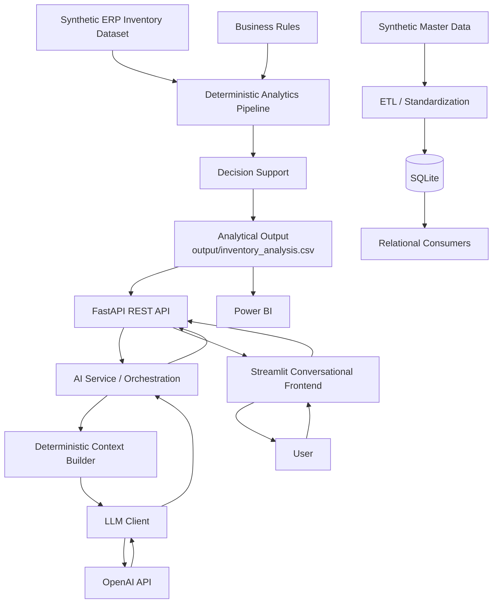

# AI Supply Chain Copilot — System Overview

## Purpose

This document provides a high-level overview of the **AI Supply Chain Copilot v1.1.0**.

The project is an end-to-end business application inspired by real-world Supply Chain planning and operational challenges, using synthetic data to preserve corporate confidentiality.

Its objective is to demonstrate how operational data can be transformed into structured analytics, deterministic decision support, Business Intelligence and AI-assisted business interpretation within a modular software architecture.

This document focuses on the system as a whole. Detailed implementation architecture and cloud deployment are documented separately.

---

# Business Problem

Supply Chain operations may contain large volumes of inventory, consumption, coverage, lead-time and supplier data.

Having this data available does not necessarily mean that decision-ready information is immediately available.

The AI Supply Chain Copilot addresses this problem by combining deterministic analytical processing with a conversational AI interface capable of helping users interpret the resulting business context.

The system is designed around a fundamental separation:

**Deterministic application components calculate and classify business information, while Generative AI interprets, synthesizes and communicates that information in natural language.**

---

# System Capabilities

The current application integrates the following capabilities:

- synthetic ERP-style data ingestion;
- ETL and data standardization;
- relational persistence with SQLite;
- inventory and Supply Chain analytics;
- configurable business rules;
- deterministic risk and priority classification;
- decision-support outputs;
- Power BI visualization;
- REST API integration through FastAPI;
- controlled context preparation for Generative AI;
- Fake and Real LLM execution modes;
- conversational interaction through Streamlit;
- automated testing;
- structured LLM evaluation;
- public cloud deployment.

---

# High-Level Architecture

The architecture contains two complementary data paths.

The **analytical path** transforms the synthetic ERP inventory dataset into deterministic analytical and decision-support outputs, which are materialized in `output/inventory_analysis.csv` and consumed by the REST API, Power BI and AI capabilities.

The **relational path** uses ETL and SQLite to maintain structured master and inventory-related entities for relational consumers.

Both paths belong to the same application architecture but currently serve different responsibilities.

---

# Core Architectural Layers

## Data and ETL

The application uses synthetic data to represent realistic Supply Chain scenarios while protecting confidential corporate information.

The current architecture contains two distinct data-processing responsibilities.

For the primary inventory analytical path, the synthetic ERP inventory dataset provides the operational information required by the deterministic analytics pipeline.

Separately, ETL and standardization processes support the relational data path used to populate structured entities maintained in SQLite.

---

## Persistence

The current architecture uses two forms of persisted application data for different purposes.

The primary analytical workflow materializes its consolidated output in:

`output/inventory_analysis.csv`

This analytical artifact is consumed by the `/inventory` REST API endpoint and supports downstream Business Intelligence and AI capabilities.

SQLite provides a separate relational persistence layer for structured master and inventory-related entities.

The two persistence mechanisms currently coexist and should not be interpreted as a single sequential pipeline.

---

## Analytics

The analytical layer transforms the synthetic ERP inventory dataset into deterministic Supply Chain metrics and structured decision-support information.

Examples include inventory value, coverage, lead-time analysis and operational risk indicators.

The resulting analytical information is materialized in `output/inventory_analysis.csv` for downstream consumption.

Exact numerical calculations remain under deterministic application control rather than being delegated to the LLM.

## Business Rules and Decision Support

Configurable business rules convert analytical information into deterministic classifications and recommended actions.

Critical calculations and classifications remain under application control rather than being delegated to the LLM.

## REST API

FastAPI exposes application capabilities through HTTP endpoints and acts as the integration contract between backend services and external consumers.

This allows presentation layers to consume backend capabilities without depending directly on their internal implementation.

## Business Intelligence

Power BI provides analytical visualization and management-oriented exploration of the structured outputs produced by the deterministic pipeline.

## AI Integration

The AI layer orchestrates the preparation of controlled business context and communication with the configured LLM client.

The application supports Fake and Real LLM execution modes, allowing controlled development, testing and external model usage.

The external LLM is used primarily for:

- interpretation;
- synthesis;
- explanation;
- natural-language communication.

Exact calculations, business rules, aggregations and classifications remain deterministic.

## Conversational Frontend

Streamlit provides the public conversational interface.

The frontend communicates with the backend through the REST API rather than containing the application's core business or AI logic.

---

# End-to-End Business Flow

The application currently contains two complementary data flows.

## Analytical Inventory Flow

The primary analytical workflow is:

`Synthetic ERP Inventory → Deterministic Analytics → Business Rules → Decision Support → inventory_analysis.csv`

The resulting analytical artifact supports multiple downstream consumers.

For Business Intelligence:

`inventory_analysis.csv → Power BI → Business User`

For conversational AI:

`inventory_analysis.csv → FastAPI → AI Service → Deterministic Context → LLM → Natural-Language Response`

The public conversational interaction can therefore be summarized as:

`User → Streamlit → FastAPI → Deterministic Business Context → LLM → FastAPI → Streamlit → User`

---

## Relational Data Flow

The relational workflow is:

`Synthetic Master / Structured Data → ETL / Standardization → SQLite → Relational Consumers`

SQLite currently maintains structured master and inventory-related entities and serves relational application capabilities independently from the primary analytical inventory artifact.

---

## Shared Architectural Principle

Although the analytical and relational paths use different persistence mechanisms, they belong to the same application architecture and preserve the same separation of responsibilities.

Deterministic application components remain responsible for establishing business facts.

Business Intelligence and Generative AI consume those deterministic outputs rather than independently redefining the underlying calculations.

---

# AI Design Principle

The AI Supply Chain Copilot follows a hybrid deterministic and generative architecture.

The LLM is not treated as the system of record or as the primary calculation engine.

Instead:

**Application code determines facts.**

**The LLM communicates and interprets those facts.**

This design reduces the risk of delegating exact business calculations to probabilistic model behavior while preserving the flexibility of natural-language interaction.

The architecture was validated through automated testing, Golden Set evaluation and comparative real-model execution before the public cloud deployment milestone.

---

# Deployment Overview

Version **v1.1.0** is publicly deployed through a distributed cloud architecture.

The main runtime topology is:

`User → Streamlit Community Cloud → FastAPI on Render → Application Layers → OpenAI API → FastAPI → Streamlit → User`

GitHub acts as the version-controlled source for the deployed application components.

Environment-specific runtime configuration allows the same core codebase to operate locally and in cloud environments without embedding deployment-specific values into the core business logic.

Detailed deployment architecture is documented in:

[`docs/architecture/05_cloud_deployment.md`](05_cloud_deployment.md)

---

# Engineering Principles

The project follows several architectural and engineering principles:

- Separation of Concerns
- Single Responsibility Principle
- Low Coupling
- High Cohesion
- Deterministic Business Logic
- Configuration over Hardcoding
- Environment-based Runtime Configuration
- Modular Architecture
- API-based Integration
- Business-driven Development
- Incremental Evolution
- Synthetic Data for Confidentiality Protection

The underlying engineering philosophy remains:

> Technology exists to solve business problems.

New technologies are introduced when they support a clear business or architectural requirement rather than for technology adoption alone.

---

# Current Development Stage

The **AI Supply Chain Copilot v1.1.0** is a functional cloud-deployed portfolio application.

The current implementation includes the complete path from synthetic operational data through deterministic analytics and decision support to Business Intelligence, REST API integration, Generative AI and a public conversational frontend.

The current milestone validates:

- end-to-end application architecture;
- deterministic analytical processing;
- configurable business rules;
- REST API integration;
- Business Intelligence;
- controlled Generative AI integration;
- real LLM behavior through structured evaluation;
- frontend/backend separation;
- environment-based configuration;
- public cloud deployment;
- distributed end-to-end integration.

The application remains portfolio-grade rather than production-ready.

Future evolution may introduce production hardening capabilities such as managed relational persistence, authentication and authorization, observability, centralized secrets management, containerization, CI/CD automation, scalability and additional AI governance controls.

---

# Documentation Map

The architecture documentation is organized by responsibility:

| Document | Purpose |
|---|---|
| `01_system_overview.md` | High-level system and business architecture |
| `02_current_architecture.md` | Current technical implementation architecture |
| `03_data_model.md` | Data model and persistence structure |
| `04_decision_log.md` | Significant architectural decisions |
| `05_cloud_deployment.md` | Cloud deployment architecture and runtime topology |

Together, these documents provide progressively deeper views of the same application.

---

# Status

**Project:** AI Supply Chain Copilot  
**Version:** v1.1.0  
**Status:** Active Development  
**Current Stage:** Functional Cloud-Deployed Portfolio Application