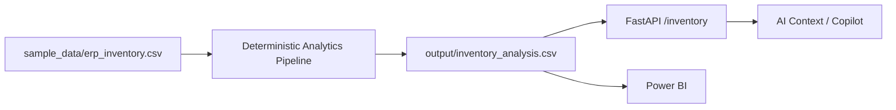
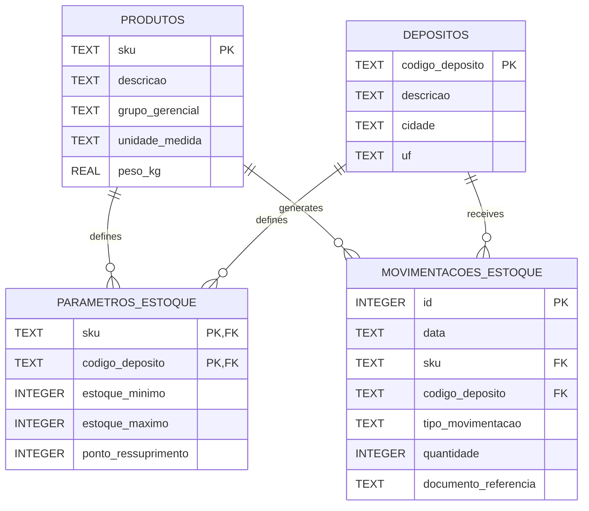

# Data Model

## Purpose

This document describes the current data architecture and data representations used by the **AI Supply Chain Copilot v1.1.0**.

Its objective is to explain how operational source data is transformed into structured application data, persisted, analyzed and converted into deterministic business information.

This document focuses on the data model and data lifecycle rather than application orchestration or cloud deployment.

---

# Data Architecture Overview

The current application contains two complementary data paths with different responsibilities.

## Analytical Inventory Path

The primary analytical workflow used by the Inventory Analytics, REST API `/inventory`, Power BI and AI Copilot is based on the synthetic ERP inventory dataset.



The synthetic ERP dataset contains the operational inventory information required by the analytical pipeline, including stock levels, consumption, costs, lead times, suppliers, warehouses and ABC classification.

The deterministic analytical scripts transform this source information into the consolidated analytical artifact:

`output/inventory_analysis.csv`

This file currently acts as the operational analytical dataset consumed by the `/inventory` API endpoint and downstream analytical and AI capabilities.

---

## Relational Reference Data Path

The project also maintains a SQLite relational model used for structured master and inventory-related entities.


The current SQLite database contains structured entities such as:

- products;
- warehouses;
- inventory parameters;
- inventory movements.

For example, the `/products` API endpoint retrieves product master data directly from SQLite.

---

## Current Architectural Distinction

The analytical inventory dataset and the relational SQLite model currently coexist in the application but serve different responsibilities.

The current analytical Copilot flow is primarily:

`Synthetic ERP Inventory → Deterministic Analytics → inventory_analysis.csv → FastAPI → AI Context → LLM`

The relational path is:

`Master / Structured Data → ETL → SQLite → Relational Consumers`

Therefore, SQLite should not currently be interpreted as the exclusive persistence source for the 300-SKU analytical inventory dataset used by the Copilot.

This distinction reflects the incremental evolution of the project and should remain explicit until the analytical and relational persistence models are unified in a future architectural milestone.
---

# Data Representations

The application uses different data representations depending on the responsibility of each processing stage.

## Source Files

Synthetic ERP-style files represent the external operational data supplied to the application.

They simulate realistic business information while protecting confidential corporate data.

Source files should be treated as input artifacts rather than as the application's analytical model.

---

## Pandas DataFrames

During ETL and analytical processing, data may be loaded into Pandas DataFrames.

A DataFrame is an in-memory tabular data structure used for operations such as:

- transformation;
- cleaning;
- filtering;
- aggregation;
- calculation;
- validation.

A DataFrame is not itself a database or permanent persistence mechanism.

Its lifecycle normally exists within the execution of the application process unless its contents are explicitly persisted elsewhere.

---

## Relational Persistence

SQLite provides the current relational persistence layer.

Persisted data survives beyond the lifetime of an individual Python DataFrame or function execution because it is written to a database file.

The persistence layer separates stored application data from temporary in-memory processing structures.

---

## Analytical Data

The analytical layer derives deterministic Supply Chain information from the synthetic ERP inventory dataset and produces the consolidated analytical output consumed by the application.

Current analytical concepts include:

- inventory value;
- inventory coverage;
- lead time;
- rupture risk;
- financial impact;
- ABC classification;
- prioritization scores;
- supplier aggregations.

These values are calculated by application logic rather than generated by the LLM.

---

## Decision-Support Data

Analytical outputs are transformed into business classifications and recommended actions.

Current concepts include:

- `REPOR`;
- `TRATAR EXCESSO`;
- `SEM AÇÃO`;
- priority classification;
- rupture-risk classification;
- action value.

Decision-support data represents business interpretation produced deterministically from operational and analytical information.

---

# Data Lifecycle

The current lifecycle can be represented as:

```text
Synthetic ERP Inventory
        │
        ▼
Pandas DataFrame
        │
        ▼
Validation / Transformation
        │
        ▼
Deterministic Analytics
        │
        ▼
Decision-Support Calculations
        │
        ▼
output/inventory_analysis.csv
        │
        ├────────► REST API
        │
        ├────────► Power BI
        │
        └────────► AI Context
```

This separation prevents presentation and Generative AI components from becoming the source of business facts.

---

# Deterministic Data Ownership

The application treats deterministic data as the authoritative source for business calculations.

The LLM does not own or independently calculate core business metrics.

Instead, the AI layer receives controlled information produced by deterministic components.

The principle is:

**Data and application logic establish the facts; Generative AI interprets and communicates them.**

This distinction is particularly important for:

- exact counts;
- sums;
- averages;
- minimum and maximum values;
- supplier frequency;
- ties;
- inventory metrics;
- scoring;
- business classifications.

---

# Data Consumers

The same deterministic data foundation supports multiple consumers.

| Consumer | Data Usage |
|---|---|
| Analytics Layer | Calculates deterministic business metrics |
| Decision Support | Produces classifications and recommended actions |
| REST API | Exposes structured application information |
| Power BI | Provides analytical visualization |
| AI Context Builder | Supplies controlled business context to the LLM |
| Streamlit Frontend | Presents responses received through the API |

Consumers should not independently redefine the authoritative business calculations.

---

# Persistence Scope

SQLite is currently appropriate for the project's synthetic and primarily analytical workload.

The current application does not depend on continuous user-generated transactional writes.

For a future production-oriented architecture, the persistence layer may evolve toward a managed relational database such as PostgreSQL.

Such evolution should preserve the logical data responsibilities even if the physical persistence technology changes.

Detailed cloud persistence considerations are documented in:

[`05_cloud_deployment.md`](05_cloud_deployment.md)

---

# Physical Schema

The current SQLite database contains four application tables:

| Table | Purpose |
|---|---|
| `produtos` | Product master data |
| `depositos` | Warehouse master data |
| `parametros_estoque` | Inventory parameters by product and warehouse |
| `movimentacoes_estoque` | Inventory movement records |

SQLite also maintains the internal `sqlite_sequence` table to support the autoincrement identifier used by `movimentacoes_estoque`. This table is managed by SQLite and is not part of the application's business data model.

---

## Entity Relationship Overview



---

## `produtos`

Stores product master data.

| Column | Type | Constraint / Purpose |
|---|---|---|
| `sku` | TEXT | Primary Key |
| `descricao` | TEXT | Required product description |
| `grupo_gerencial` | TEXT | Required managerial product group |
| `unidade_medida` | TEXT | Required unit of measure |
| `peso_kg` | REAL | Required; must be greater than or equal to zero |

The `sku` field uniquely identifies each product and is referenced by inventory-related tables.

---

## `depositos`

Stores warehouse master data.

| Column | Type | Constraint / Purpose |
|---|---|---|
| `codigo_deposito` | TEXT | Primary Key |
| `descricao` | TEXT | Required warehouse description |
| `cidade` | TEXT | Required city |
| `uf` | TEXT | Required state identifier |

`codigo_deposito` uniquely identifies each warehouse.

---

## `parametros_estoque`

Stores inventory-control parameters for each product and warehouse combination.

| Column | Type | Constraint / Purpose |
|---|---|---|
| `sku` | TEXT | Composite Primary Key; Foreign Key → `produtos.sku` |
| `codigo_deposito` | TEXT | Composite Primary Key; Foreign Key → `depositos.codigo_deposito` |
| `estoque_minimo` | INTEGER | Required; must be greater than or equal to zero |
| `estoque_maximo` | INTEGER | Required; must be greater than or equal to `estoque_minimo` |
| `ponto_ressuprimento` | INTEGER | Required; must be greater than or equal to zero |

The composite primary key:

`(sku, codigo_deposito)`

ensures that each product can have one inventory-parameter configuration for each warehouse.

This models the fact that inventory policies may vary by both product and physical location.

---

## `movimentacoes_estoque`

Stores inventory movement records.

| Column | Type | Constraint / Purpose |
|---|---|---|
| `id` | INTEGER | Primary Key; Auto Increment |
| `data` | TEXT | Required movement date |
| `sku` | TEXT | Required; Foreign Key → `produtos.sku` |
| `codigo_deposito` | TEXT | Required; Foreign Key → `depositos.codigo_deposito` |
| `tipo_movimentacao` | TEXT | Required; `ENTRADA` or `SAIDA` |
| `quantidade` | INTEGER | Required; must be greater than zero |
| `documento_referencia` | TEXT | Optional reference document |

The database enforces the following movement-type constraint:

`tipo_movimentacao IN ('ENTRADA', 'SAIDA')`

and requires:

`quantidade > 0`

Movement direction is therefore represented explicitly by `tipo_movimentacao` rather than by positive and negative quantity values.

---

# Relationships

The physical model currently contains two master entities:

- `produtos`;
- `depositos`.

These entities are referenced by both inventory-related tables.

The relationship structure is:

```text
produtos ───────┐
                ├──► parametros_estoque
depositos ──────┘

produtos ───────┐
                ├──► movimentacoes_estoque
depositos ──────┘
```

This allows inventory information to be modeled at the intersection of:

**Product × Warehouse**

rather than treating inventory as an attribute of the product alone.

---

# Database Constraints

The current physical schema implements several deterministic integrity controls directly at database level.

These include:

- product primary-key uniqueness;
- warehouse primary-key uniqueness;
- composite uniqueness for product/warehouse inventory parameters;
- foreign-key relationships between inventory tables and master entities;
- non-negative product weight;
- non-negative minimum inventory;
- maximum inventory greater than or equal to minimum inventory;
- non-negative reorder point;
- positive inventory-movement quantity;
- controlled inventory-movement types.

These constraints complement application-level validation by protecting structural data integrity within the relational model.

---

# Current Database State

At the time of this documentation review, the supplied SQLite database contains:

| Table | Current Rows |
|---|---:|
| `produtos` | 5 |
| `depositos` | 3 |
| `parametros_estoque` | 0 |
| `movimentacoes_estoque` | 0 |

These row counts represent the inspected database instance and are not architectural constraints.

The schema is therefore more important than the current record volume when describing the application's physical data model.

---

# Data Modeling Principles

The current data architecture follows these principles:

## Synthetic Data by Design

Published business data is fictional or synthetic and does not expose proprietary corporate information.

## Canonicalization

Source-specific structures are standardized before downstream business processing.

## Persistence Separation

Temporary in-memory processing structures and persisted application data have distinct responsibilities.

## Deterministic Calculations

Business metrics and classifications are calculated through deterministic application logic.

## Reusability

The same structured analytical foundation can serve API, BI and AI consumers.

## Technology Independence

Higher application layers should depend on the logical data model rather than unnecessary details of the physical persistence technology.

---

# Document Relationships

| Document | Responsibility |
|---|---|
| `01_system_overview.md` | High-level system and business architecture |
| `02_current_architecture.md` | Current technical implementation |
| `04_decision_log.md` | Significant architectural decisions |
| `05_cloud_deployment.md` | Cloud persistence and deployment considerations |

---

# Document Information

| Property | Value |
|---|---|
| Document | Data Model |
| Directory | `docs/architecture` |
| Application Version | v1.1.0 |
| Status | Active |
| Last Updated | August 2026 |