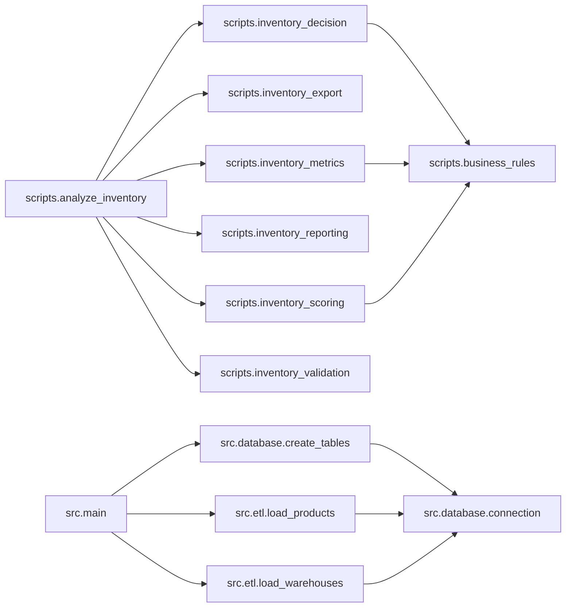

# Project Audit

Gerado em: 02/08/2026 20:40:15

> Este arquivo é gerado automaticamente. Não edite manualmente.

## 1. Resumo executivo

- Arquivos Python: **14**
- Linhas totais: **1278**
- Linhas efetivas de código: **955**
- Funções: **42**
- Classes: **0**
- Imports internos: **15**
- Imports externos: **9**
- Imports da biblioteca padrão: **11**
- TODOs/FIXMEs em comentários: **0**
- Funções sem docstring: **0**
- Arquivos com erro de sintaxe: **0**

## 2. Como usar as opções True e False

As variáveis abaixo ficam no início de `project_audit.py`:

```python
INCLUIR_CODIGO_FONTE = False
INCLUIR_FERRAMENTAS_AUDITORIA = False
```

- `False`: mantém a opção desativada.
- `True`: ativa a opção.
- Para o checkpoint normal, mantenha as duas como `False`.
- Ative `INCLUIR_CODIGO_FONTE` somente quando precisar enviar todo o código para revisão.
- Ative `INCLUIR_FERRAMENTAS_AUDITORIA` somente quando quiser auditar também o próprio auditor.

## 3. Pipeline principal

```text
analyze_inventory.py
↓
inventory_validation.py
↓
inventory_metrics.py
↓
inventory_scoring.py
↓
inventory_decision.py
↓
inventory_reporting.py
↓
inventory_export.py
```

## 4. Project Health

> Notas heurísticas calculadas automaticamente.

| Dimensão | Nota |
|---|---:|
| Modularização | 10.0/10 |
| Cobertura de docstrings | 10.0/10 |
| Complexidade estrutural | 10.0/10 |
| Integridade sintática | 10.0/10 |
| Saúde geral | **10.0/10** |

## 5. Estrutura do projeto

```text
ai-supply-chain-copilot/
├── .gitignore
├── assets/
│   ├── .gitkeep
│   ├── images/
│   │   └── .gitkeep
│   └── screenshots/
│       └── .gitkeep
├── backend/
│   └── .gitkeep
├── config/
│   └── business_rules.json
├── data/
│   ├── processed/
│   │   └── .gitkeep
│   ├── raw/
│   │   ├── depositos.csv
│   │   └── produtos.csv
│   └── synthetic/
│       └── .gitkeep
├── database/
│   └── inventory.db
├── docs/
│   ├── architecture/
│   │   ├── 01_system_overview.md
│   │   ├── 02_current_architecture.md
│   │   ├── 03_data_model.md
│   │   └── 04_decision_log.md
│   ├── decisions/
│   │   └── .gitkeep
│   ├── diagrams/
│   │   └── .gitkeep
│   ├── images/
│   │   └── architecture-overview.png
│   ├── milestones
│   ├── project_audit/
│   │   └── PROJECT_AUDIT.md
│   └── roadmap/
│       ├── AI_Supply_Chain_Copilot_Gantt_v0.2.0.xlsx
│       └── roadmap.md
├── frontend/
│   └── .gitkeep
├── notebooks/
│   └── .gitkeep
├── output/
│   └── inventory_analysis.csv
├── README.md
├── reports/
│   ├── excel/
│   │   └── indicadores_r1.xlsx
│   └── powerbi/
│       ├── AI_Supply_Chain_Copilot.pbix
│       └── screenshots/
│           └── dashboard.png
├── requirements.txt
├── sample_data/
│   └── erp_inventory.csv
├── scripts/
│   ├── analyze_inventory.py
│   ├── business_rules.py
│   ├── database_setup.py
│   ├── inventory_decision.py
│   ├── inventory_export.py
│   ├── inventory_metrics.py
│   ├── inventory_reporting.py
│   ├── inventory_scoring.py
│   ├── inventory_validation.py
│   └── project_audit.py
├── src/
│   ├── analysis
│   ├── database/
│   │   ├── connection.py
│   │   └── create_tables.py
│   ├── etl/
│   │   ├── load_products.py
│   │   └── load_warehouses.py
│   ├── main.py
│   └── utils/
│       └── .gitkeep
└── tests/
    └── .gitkeep
```

## 6. Arquivos Python

| Arquivo | Linhas | Funções | Classes | TODOs |
|---|---:|---:|---:|---:|
| `scripts/analyze_inventory.py` | 39 | 1 | 0 | 0 |
| `scripts/business_rules.py` | 63 | 2 | 0 | 0 |
| `scripts/database_setup.py` | 12 | 0 | 0 | 0 |
| `scripts/inventory_decision.py` | 121 | 5 | 0 | 0 |
| `scripts/inventory_export.py` | 40 | 1 | 0 | 0 |
| `scripts/inventory_metrics.py` | 119 | 5 | 0 | 0 |
| `scripts/inventory_reporting.py` | 228 | 5 | 0 | 0 |
| `scripts/inventory_scoring.py` | 123 | 6 | 0 | 0 |
| `scripts/inventory_validation.py` | 78 | 2 | 0 | 0 |
| `src/database/connection.py` | 18 | 1 | 0 | 0 |
| `src/database/create_tables.py` | 121 | 5 | 0 | 0 |
| `src/etl/load_products.py` | 149 | 4 | 0 | 0 |
| `src/etl/load_warehouses.py` | 146 | 4 | 0 | 0 |
| `src/main.py` | 21 | 1 | 0 | 0 |

## 7. Funções e classes

### `scripts/analyze_inventory.py`

| Função | Linhas | Argumentos | Docstring |
|---|---:|---|---|
| `main` | 17–35 | `—` | SIM |

### `scripts/business_rules.py`

| Função | Linhas | Argumentos | Docstring |
|---|---:|---|---|
| `carregar_regras` | 15–33 | `—` | SIM |
| `validar_regras` | 36–55 | `regras` | SIM |

### `scripts/database_setup.py`

- Nenhuma função ou classe encontrada.

### `scripts/inventory_decision.py`

| Função | Linhas | Argumentos | Docstring |
|---|---:|---|---|
| `aplicar_decisoes` | 9–21 | `df` | SIM |
| `calcular_acao_recomendada` | 24–40 | `df` | SIM |
| `calcular_prioridade` | 43–75 | `df` | SIM |
| `gerar_grupo_gerencial` | 78–121 | `df` | SIM |
| `classificar_grupo_gerencial` | 84–116 | `linha` | SIM |

### `scripts/inventory_export.py`

| Função | Linhas | Argumentos | Docstring |
|---|---:|---|---|
| `exportar_resultados` | 14–40 | `df, caminho_saida` | SIM |

### `scripts/inventory_metrics.py`

| Função | Linhas | Argumentos | Docstring |
|---|---:|---|---|
| `calcular_metricas` | 9–23 | `df` | SIM |
| `calcular_valor_estoque` | 26–34 | `df` | SIM |
| `calcular_cobertura_e_risco` | 37–76 | `df` | SIM |
| `calcular_quantidades_e_valores` | 79–105 | `df` | SIM |
| `calcular_valor_acao` | 108–119 | `df` | SIM |

### `scripts/inventory_reporting.py`

| Função | Linhas | Argumentos | Docstring |
|---|---:|---|---|
| `exibir_relatorio` | 4–15 | `df` | SIM |
| `exibir_exploracao` | 18–37 | `df` | SIM |
| `exibir_acoes_recomendadas` | 40–77 | `df` | SIM |
| `exibir_distribuicao_das_acoes` | 80–103 | `df` | SIM |
| `exibir_resumo_executivo` | 106–228 | `df` | SIM |

### `scripts/inventory_scoring.py`

| Função | Linhas | Argumentos | Docstring |
|---|---:|---|---|
| `calcular_scores` | 9–24 | `df` | SIM |
| `calcular_score_financeiro` | 27–52 | `df` | SIM |
| `calcular_score_classe_abc` | 55–69 | `df` | SIM |
| `calcular_score_risco_ruptura` | 72–86 | `df` | SIM |
| `calcular_score_lead_time` | 89–108 | `df` | SIM |
| `calcular_score_prioridade` | 111–123 | `df` | SIM |

### `scripts/inventory_validation.py`

| Função | Linhas | Argumentos | Docstring |
|---|---:|---|---|
| `validar_dados` | 17–41 | `df` | SIM |
| `detalhar_problemas` | 44–78 | `df` | SIM |

### `src/database/connection.py`

| Função | Linhas | Argumentos | Docstring |
|---|---:|---|---|
| `conectar_banco` | 9–18 | `—` | SIM |

### `src/database/create_tables.py`

| Função | Linhas | Argumentos | Docstring |
|---|---:|---|---|
| `criar_tabela_produtos` | 4–20 | `cursor` | SIM |
| `criar_tabela_depositos` | 23–37 | `cursor` | SIM |
| `criar_tabela_parametros_estoque` | 40–66 | `cursor` | SIM |
| `criar_tabela_movimentacoes_estoque` | 69–94 | `cursor` | SIM |
| `criar_tabelas` | 97–117 | `—` | SIM |

### `src/etl/load_products.py`

| Função | Linhas | Argumentos | Docstring |
|---|---:|---|---|
| `extrair_produtos` | 11–21 | `—` | SIM |
| `transformar_produtos` | 24–93 | `df` | SIM |
| `carregar_produtos` | 96–130 | `df` | SIM |
| `main` | 133–145 | `—` | SIM |

### `src/etl/load_warehouses.py`

| Função | Linhas | Argumentos | Docstring |
|---|---:|---|---|
| `extrair_depositos` | 11–21 | `—` | SIM |
| `transformar_depositos` | 24–88 | `df` | SIM |
| `carregar_depositos` | 91–127 | `df` | SIM |
| `main` | 130–142 | `—` | SIM |

### `src/main.py`

| Função | Linhas | Argumentos | Docstring |
|---|---:|---|---|
| `main` | 6–17 | `—` | SIM |

## 8. Dependências

### Dependências internas

| Origem | Destino |
|---|---|
| `scripts.analyze_inventory` | `scripts.inventory_validation` |
| `scripts.analyze_inventory` | `scripts.inventory_metrics` |
| `scripts.analyze_inventory` | `scripts.inventory_scoring` |
| `scripts.analyze_inventory` | `scripts.inventory_decision` |
| `scripts.analyze_inventory` | `scripts.inventory_reporting` |
| `scripts.analyze_inventory` | `scripts.inventory_export` |
| `scripts.inventory_decision` | `scripts.business_rules` |
| `scripts.inventory_metrics` | `scripts.business_rules` |
| `scripts.inventory_scoring` | `scripts.business_rules` |
| `src.database.create_tables` | `src.database.connection` |
| `src.etl.load_products` | `src.database.connection` |
| `src.etl.load_warehouses` | `src.database.connection` |
| `src.main` | `src.database.create_tables` |
| `src.main` | `src.etl.load_products` |
| `src.main` | `src.etl.load_warehouses` |

### Dependências externas

- `pandas`

### Grafo de dependências internas



## 9. Observações automáticas do repositório

- Nenhuma observação de padronização encontrada.

## 10. Pendências e erros

### TODOs e FIXMEs

- Nenhum TODO ou FIXME encontrado em comentários.

### Erros de sintaxe

- Nenhum erro de sintaxe encontrado.
