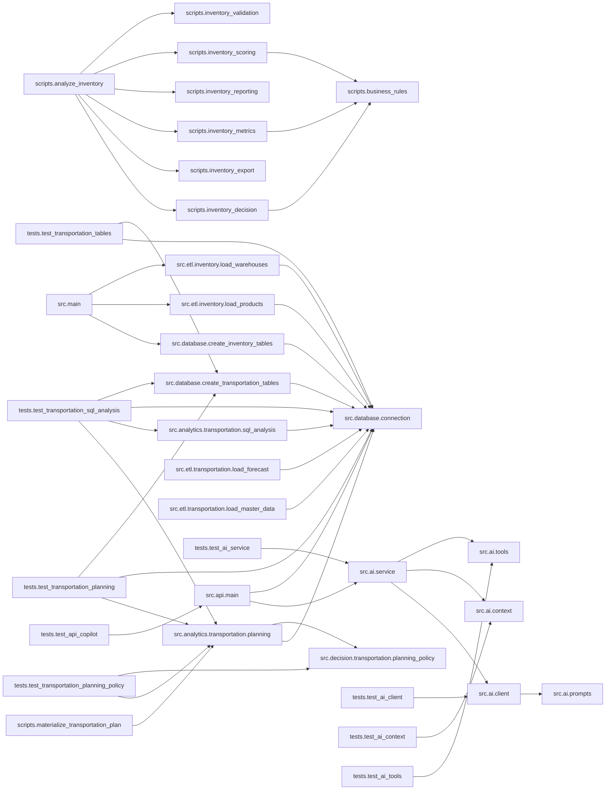

# Project Audit

Gerado em: 19/09/2026 17:48:40

> Este arquivo é gerado automaticamente. Não edite manualmente.

## 1. Resumo executivo

- Arquivos Python: **37**
- Linhas totais: **6399**
- Linhas efetivas de código: **4983**
- Funções: **211**
- Classes: **5**
- Imports internos: **74**
- Imports externos: **24**
- Imports da biblioteca padrão: **33**
- TODOs/FIXMEs em comentários: **0**
- Funções sem docstring: **44**
- Arquivos com erro de sintaxe: **0**

## 2. Como usar as opções True e False

As variáveis abaixo ficam no início de `project_audit.py`:

```python
INCLUIR_CODIGO_FONTE = False
INCLUIR_FERRAMENTAS_AUDITORIA = False
```

- `False`: mantém a opção desativada.
- `True`: ativa a opção.
- Para o checkpoint normal, mantenha as duas como `False`.
- Ative `INCLUIR_CODIGO_FONTE` somente quando precisar enviar todo o código para revisão.
- Ative `INCLUIR_FERRAMENTAS_AUDITORIA` somente quando quiser auditar também o próprio auditor.

## 3. Pipeline principal

```text
analyze_inventory.py
↓
inventory_validation.py
↓
inventory_metrics.py
↓
inventory_scoring.py
↓
inventory_decision.py
↓
inventory_reporting.py
↓
inventory_export.py
```

## 4. Entregas do projeto

| Entrega | Caminho | Status |
|---|---|:---:|
| Banco SQLite | `database/supply_chain.db` | ✅ |
| Arquivo analítico | `output/inventory_analysis.csv` | ✅ |
| Relatório Excel | `reports/excel/indicadores_r1.xlsx` | ✅ |
| Dashboard Power BI | `reports/powerbi/AI_Supply_Chain_Copilot.pbix` | ✅ |
| Screenshot do dashboard | `reports/powerbi/screenshots/dashboard.png` | ✅ |

## 5. Project Health

> Notas heurísticas calculadas automaticamente.

| Dimensão | Nota |
|---|---:|
| Modularização | 10.0/10 |
| Cobertura de docstrings | 7.9/10 |
| Complexidade estrutural | 8.9/10 |
| Integridade sintática | 10.0/10 |
| Saúde geral | **9.2/10** |

## 6. Estrutura do projeto

```text
ai-supply-chain-copilot/
├── .devcontainer/
│   └── devcontainer.json
├── .gitignore
├── config/
│   └── business_rules.json
├── data/
│   ├── processed/
│   │   └── .gitkeep
│   ├── raw/
│   │   ├── inventory/
│   │   │   ├── depositos.csv
│   │   │   └── produtos.csv
│   │   └── transportation/
│   │       └── forecast_raw.csv
│   └── synthetic/
│       └── transportation/
│           ├── route_vehicle_options.csv
│           ├── route_vehicle_rates.csv
│           ├── routes.csv
│           └── vehicle_types.csv
├── database/
│   └── supply_chain.db
├── docs/
│   ├── architecture/
│   │   ├── 01_system_overview.md
│   │   ├── 02_current_architecture.md
│   │   ├── 03_data_model.md
│   │   ├── 04_decision_log.md
│   │   ├── 05_cloud_deployment.md
│   │   └── 06_transportation_architecture.md
│   ├── backlog/
│   │   └── backlog.md
│   ├── evaluations/
│   │   └── LLM_Real_Model_Benchmark_Final.xlsx
│   ├── images/
│   │   ├── architecture-overview.png
│   │   ├── art-end-to-end-copilot-flow.png
│   │   ├── art-stack-and-agentic-flow.png
│   │   ├── banner.png
│   │   ├── featured.png
│   │   ├── first-llm-real-answer.png
│   │   └── public-mobile-validation.png
│   ├── presentations/
│   │   ├── AI-Supply-Chain-Copilot.pdf
│   │   └── AI-Supply-Chain-Copilot.pptx
│   ├── project_audit/
│   │   └── PROJECT_AUDIT.md
│   └── roadmap/
│       └── AI_Supply_Chain_Copilot_Gantt_v0.2.0.xlsx
├── frontend/
│   └── app.py
├── output/
│   └── inventory_analysis.csv
├── README.md
├── reports/
│   ├── excel/
│   │   └── indicadores_r1.xlsx
│   └── powerbi/
│       ├── AI_Supply_Chain_Copilot.pbix
│       ├── screenshots/
│       │   └── dashboard.png
│       └── themes/
│           └── ai_supply_chain_dark.json
├── requirements.txt
├── sample_data/
│   └── erp_inventory.csv
├── scripts/
│   ├── analyze_inventory.py
│   ├── business_rules.py
│   ├── database_setup.py
│   ├── inventory_decision.py
│   ├── inventory_export.py
│   ├── inventory_metrics.py
│   ├── inventory_reporting.py
│   ├── inventory_scoring.py
│   ├── inventory_validation.py
│   ├── materialize_transportation_plan.py
│   └── project_audit.py
├── src/
│   ├── ai/
│   │   ├── client.py
│   │   ├── context.py
│   │   ├── prompts.py
│   │   ├── service.py
│   │   └── tools.py
│   ├── analytics/
│   │   └── transportation/
│   │       ├── planning.py
│   │       └── sql_analysis.py
│   ├── api/
│   │   └── main.py
│   ├── database/
│   │   ├── connection.py
│   │   ├── create_inventory_tables.py
│   │   └── create_transportation_tables.py
│   ├── decision/
│   │   └── transportation/
│   │       └── planning_policy.py
│   ├── etl/
│   │   ├── inventory/
│   │   │   ├── load_products.py
│   │   │   └── load_warehouses.py
│   │   └── transportation/
│   │       ├── load_forecast.py
│   │       └── load_master_data.py
│   └── main.py
└── tests/
    ├── golden_test_set.md
    ├── test_ai_client.py
    ├── test_ai_context.py
    ├── test_ai_service.py
    ├── test_ai_tools.py
    ├── test_api_copilot.py
    ├── test_transportation_planning.py
    ├── test_transportation_planning_policy.py
    ├── test_transportation_sql_analysis.py
    └── test_transportation_tables.py
```

## 7. Arquivos Python

| Arquivo | Linhas | Funções | Classes | TODOs |
|---|---:|---:|---:|---:|
| `frontend/app.py` | 520 | 2 | 0 | 0 |
| `scripts/analyze_inventory.py` | 39 | 1 | 0 | 0 |
| `scripts/business_rules.py` | 63 | 2 | 0 | 0 |
| `scripts/database_setup.py` | 12 | 0 | 0 | 0 |
| `scripts/inventory_decision.py` | 121 | 5 | 0 | 0 |
| `scripts/inventory_export.py` | 96 | 3 | 0 | 0 |
| `scripts/inventory_metrics.py` | 119 | 5 | 0 | 0 |
| `scripts/inventory_reporting.py` | 228 | 5 | 0 | 0 |
| `scripts/inventory_scoring.py` | 123 | 6 | 0 | 0 |
| `scripts/inventory_validation.py` | 78 | 2 | 0 | 0 |
| `scripts/materialize_transportation_plan.py` | 17 | 1 | 0 | 0 |
| `src/ai/client.py` | 255 | 7 | 0 | 0 |
| `src/ai/context.py` | 144 | 2 | 0 | 0 |
| `src/ai/prompts.py` | 239 | 0 | 0 | 0 |
| `src/ai/service.py` | 32 | 1 | 0 | 0 |
| `src/ai/tools.py` | 81 | 1 | 0 | 0 |
| `src/analytics/transportation/planning.py` | 247 | 7 | 0 | 0 |
| `src/analytics/transportation/sql_analysis.py` | 627 | 10 | 0 | 0 |
| `src/api/main.py` | 209 | 8 | 1 | 0 |
| `src/database/connection.py` | 19 | 1 | 0 | 0 |
| `src/database/create_inventory_tables.py` | 121 | 5 | 0 | 0 |
| `src/database/create_transportation_tables.py` | 156 | 8 | 0 | 0 |
| `src/decision/transportation/planning_policy.py` | 187 | 8 | 0 | 0 |
| `src/etl/inventory/load_products.py` | 149 | 4 | 0 | 0 |
| `src/etl/inventory/load_warehouses.py` | 146 | 4 | 0 | 0 |
| `src/etl/transportation/load_forecast.py` | 69 | 5 | 0 | 0 |
| `src/etl/transportation/load_master_data.py` | 94 | 9 | 0 | 0 |
| `src/main.py` | 21 | 1 | 0 | 0 |
| `tests/test_ai_client.py` | 475 | 22 | 3 | 0 |
| `tests/test_ai_context.py` | 127 | 5 | 0 | 0 |
| `tests/test_ai_service.py` | 238 | 13 | 0 | 0 |
| `tests/test_ai_tools.py` | 135 | 14 | 1 | 0 |
| `tests/test_api_copilot.py` | 110 | 6 | 0 | 0 |
| `tests/test_transportation_planning.py` | 215 | 6 | 0 | 0 |
| `tests/test_transportation_planning_policy.py` | 263 | 19 | 0 | 0 |
| `tests/test_transportation_sql_analysis.py` | 580 | 12 | 0 | 0 |
| `tests/test_transportation_tables.py` | 44 | 1 | 0 | 0 |

## 8. Funções e classes

### `frontend/app.py`

| Função | Linhas | Argumentos | Docstring |
|---|---:|---|---|
| `api_esta_online` | 191–200 | `—` | NÃO |
| `consultar_copilot` | 203–274 | `pergunta` | NÃO |

### `scripts/analyze_inventory.py`

| Função | Linhas | Argumentos | Docstring |
|---|---:|---|---|
| `main` | 17–35 | `—` | SIM |

### `scripts/business_rules.py`

| Função | Linhas | Argumentos | Docstring |
|---|---:|---|---|
| `carregar_regras` | 15–33 | `—` | SIM |
| `validar_regras` | 36–55 | `regras` | SIM |

### `scripts/database_setup.py`

- Nenhuma função ou classe encontrada.

### `scripts/inventory_decision.py`

| Função | Linhas | Argumentos | Docstring |
|---|---:|---|---|
| `aplicar_decisoes` | 9–21 | `df` | SIM |
| `calcular_acao_recomendada` | 24–40 | `df` | SIM |
| `calcular_prioridade` | 43–75 | `df` | SIM |
| `gerar_grupo_gerencial` | 78–121 | `df` | SIM |
| `classificar_grupo_gerencial` | 84–116 | `linha` | SIM |

### `scripts/inventory_export.py`

| Função | Linhas | Argumentos | Docstring |
|---|---:|---|---|
| `exportar_resultados` | 11–24 | `df, caminho_saida` | SIM |
| `exportar_csv` | 27–52 | `df, caminho_saida` | SIM |
| `exportar_excel` | 55–96 | `df, caminho_excel` | SIM |

### `scripts/inventory_metrics.py`

| Função | Linhas | Argumentos | Docstring |
|---|---:|---|---|
| `calcular_metricas` | 9–23 | `df` | SIM |
| `calcular_valor_estoque` | 26–34 | `df` | SIM |
| `calcular_cobertura_e_risco` | 37–76 | `df` | SIM |
| `calcular_quantidades_e_valores` | 79–105 | `df` | SIM |
| `calcular_valor_acao` | 108–119 | `df` | SIM |

### `scripts/inventory_reporting.py`

| Função | Linhas | Argumentos | Docstring |
|---|---:|---|---|
| `exibir_relatorio` | 4–15 | `df` | SIM |
| `exibir_exploracao` | 18–37 | `df` | SIM |
| `exibir_acoes_recomendadas` | 40–77 | `df` | SIM |
| `exibir_distribuicao_das_acoes` | 80–103 | `df` | SIM |
| `exibir_resumo_executivo` | 106–228 | `df` | SIM |

### `scripts/inventory_scoring.py`

| Função | Linhas | Argumentos | Docstring |
|---|---:|---|---|
| `calcular_scores` | 9–24 | `df` | SIM |
| `calcular_score_financeiro` | 27–52 | `df` | SIM |
| `calcular_score_classe_abc` | 55–69 | `df` | SIM |
| `calcular_score_risco_ruptura` | 72–86 | `df` | SIM |
| `calcular_score_lead_time` | 89–108 | `df` | SIM |
| `calcular_score_prioridade` | 111–123 | `df` | SIM |

### `scripts/inventory_validation.py`

| Função | Linhas | Argumentos | Docstring |
|---|---:|---|---|
| `validar_dados` | 17–41 | `df` | SIM |
| `detalhar_problemas` | 44–78 | `df` | SIM |

### `scripts/materialize_transportation_plan.py`

| Função | Linhas | Argumentos | Docstring |
|---|---:|---|---|
| `main` | 6–13 | `—` | SIM |

### `src/ai/client.py`

| Função | Linhas | Argumentos | Docstring |
|---|---:|---|---|
| `validar_configuracao_cliente` | 25–53 | `—` | SIM |
| `validar_limites_contexto` | 56–85 | `contexto` | SIM |
| `montar_requisicao` | 88–108 | `pergunta, contexto` | SIM |
| `gerar_resposta` | 111–143 | `pergunta, contexto` | SIM |
| `gerar_resposta_real` | 146–178 | `pergunta, contexto` | SIM |
| `gerar_resposta_fake` | 181–207 | `pergunta, contexto` | SIM |
| `obter_quantidade_registros` | 210–226 | `contexto` | SIM |

### `src/ai/context.py`

| Função | Linhas | Argumentos | Docstring |
|---|---:|---|---|
| `calcular_agregacao_fornecedores` | 8–57 | `registros` | SIM |
| `preparar_contexto` | 60–144 | `inventario` | SIM |

### `src/ai/prompts.py`

- Nenhuma função ou classe encontrada.

### `src/ai/service.py`

| Função | Linhas | Argumentos | Docstring |
|---|---:|---|---|
| `responder` | 6–20 | `pergunta` | SIM |

### `src/ai/tools.py`

| Função | Linhas | Argumentos | Docstring |
|---|---:|---|---|
| `listar_inventario` | 18–69 | `—` | SIM |

### `src/analytics/transportation/planning.py`

| Função | Linhas | Argumentos | Docstring |
|---|---:|---|---|
| `buscar_alternativas_veiculo` | 15–38 | `route_id` | SIM |
| `analisar_alternativas_planejamento` | 41–96 | `route_id, week_start` | SIM |
| `analisar_cenarios_planejamento` | 99–154 | `route_id, week_start` | SIM |
| `selecionar_plano` | 157–167 | `route_id, week_start` | SIM |
| `gerar_plano_planejado` | 170–180 | `route_id, week_start` | SIM |
| `salvar_viagens_planejadas` | 183–216 | `viagens` | SIM |
| `materializar_plano_completo` | 219–246 | `—` | SIM |

### `src/analytics/transportation/sql_analysis.py`

| Função | Linhas | Argumentos | Docstring |
|---|---:|---|---|
| `analisar_operacao_forecast` | 6–53 | `—` | SIM |
| `analisar_eficiencia_economica` | 56–118 | `—` | SIM |
| `analisar_evolucao_semanal` | 121–223 | `—` | SIM |
| `analisar_participacao_custo_rede` | 226–268 | `—` | SIM |
| `analisar_ranking_custo_semanal` | 270–302 | `—` | SIM |
| `analisar_concentracao_custo_rede` | 305–349 | `—` | SIM |
| `analisar_tendencia_recente` | 352–421 | `—` | SIM |
| `analisar_mudancas_operacionais` | 424–491 | `—` | SIM |
| `analisar_pressao_custo_rede` | 494–534 | `—` | SIM |
| `analisar_resumo_executivo_semanal` | 537–627 | `—` | SIM |

### `src/api/main.py`

| Função | Linhas | Argumentos | Docstring |
|---|---:|---|---|
| `carregar_inventario` | 14–29 | `—` | SIM |
| `raiz` | 51–59 | `—` | SIM |
| `verificar_saude` | 63–70 | `—` | SIM |
| `listar_produtos` | 74–105 | `—` | SIM |
| `buscar_produto` | 109–144 | `sku` | SIM |
| `listar_inventario` | 148–157 | `—` | SIM |
| `obter_dashboard` | 161–186 | `—` | SIM |
| `consultar_copilot` | 190–209 | `entrada` | SIM |

| Classe | Linhas | Docstring |
|---|---:|---|
| `PerguntaCopilot` | 32–37 | SIM |

### `src/database/connection.py`

| Função | Linhas | Argumentos | Docstring |
|---|---:|---|---|
| `conectar_banco` | 8–19 | `—` | SIM |

### `src/database/create_inventory_tables.py`

| Função | Linhas | Argumentos | Docstring |
|---|---:|---|---|
| `criar_tabela_produtos` | 4–20 | `cursor` | SIM |
| `criar_tabela_depositos` | 23–37 | `cursor` | SIM |
| `criar_tabela_parametros_estoque` | 40–66 | `cursor` | SIM |
| `criar_tabela_movimentacoes_estoque` | 69–94 | `cursor` | SIM |
| `criar_tabelas_inventory` | 97–117 | `—` | SIM |

### `src/database/create_transportation_tables.py`

| Função | Linhas | Argumentos | Docstring |
|---|---:|---|---|
| `criar_tabela_routes` | 6–17 | `cursor` | SIM |
| `criar_tabela_vehicle_types` | 20–30 | `cursor` | SIM |
| `criar_tabela_route_vehicle_options` | 33–50 | `cursor` | SIM |
| `criar_tabela_route_vehicle_rates` | 53–77 | `cursor` | SIM |
| `criar_tabela_forecast_raw` | 80–96 | `cursor` | SIM |
| `criar_tabela_demand_forecast` | 99–111 | `cursor` | SIM |
| `criar_tabela_planned_trips` | 114–134 | `cursor` | SIM |
| `criar_tabelas_transportation` | 137–150 | `—` | SIM |

### `src/decision/transportation/planning_policy.py`

| Função | Linhas | Argumentos | Docstring |
|---|---:|---|---|
| `calcular_viagens_necessarias` | 6–14 | `forecast_pieces, capacity_pieces, target_frequency` | SIM |
| `classificar_perfil_rota` | 17–25 | `distance_km` | SIM |
| `obter_frequencia_alvo` | 28–39 | `route_profile` | SIM |
| `calcular_metricas_alternativa` | 42–66 | `forecast_pieces, capacity_pieces, rate_per_trip, target_frequency` | SIM |
| `selecionar_alternativa` | 69–88 | `alternativas` | SIM |
| `gerar_viagens_planejadas` | 91–125 | `plano` | SIM |
| `calcular_viagens_por_capacidade` | 128–133 | `forecast_pieces, capacity_pieces` | SIM |
| `calcular_cenarios_planejamento` | 136–187 | `forecast_pieces, capacity_pieces, rate_per_trip, target_frequency` | SIM |

### `src/etl/inventory/load_products.py`

| Função | Linhas | Argumentos | Docstring |
|---|---:|---|---|
| `extrair_produtos` | 11–21 | `—` | SIM |
| `transformar_produtos` | 24–93 | `df` | SIM |
| `carregar_produtos` | 96–130 | `df` | SIM |
| `main` | 133–145 | `—` | SIM |

### `src/etl/inventory/load_warehouses.py`

| Função | Linhas | Argumentos | Docstring |
|---|---:|---|---|
| `extrair_depositos` | 11–21 | `—` | SIM |
| `transformar_depositos` | 24–88 | `df` | SIM |
| `carregar_depositos` | 91–127 | `df` | SIM |
| `main` | 130–142 | `—` | SIM |

### `src/etl/transportation/load_forecast.py`

| Função | Linhas | Argumentos | Docstring |
|---|---:|---|---|
| `extrair_forecast` | 15–17 | `—` | SIM |
| `transformar_forecast` | 20–35 | `df` | SIM |
| `carregar_forecast_raw` | 38–46 | `df` | SIM |
| `carregar_demand_forecast` | 49–57 | `df` | SIM |
| `main` | 59–65 | `—` | SIM |

### `src/etl/transportation/load_master_data.py`

| Função | Linhas | Argumentos | Docstring |
|---|---:|---|---|
| `extrair_routes` | 16–18 | `—` | SIM |
| `carregar_routes` | 21–29 | `df` | SIM |
| `extrair_vehicle_types` | 32–34 | `—` | SIM |
| `carregar_vehicle_types` | 37–45 | `df` | SIM |
| `extrair_route_vehicle_options` | 48–50 | `—` | SIM |
| `carregar_route_vehicle_options` | 53–61 | `df` | SIM |
| `extrair_route_vehicle_rates` | 64–66 | `—` | SIM |
| `carregar_route_vehicle_rates` | 69–77 | `df` | SIM |
| `main` | 80–90 | `—` | SIM |

### `src/main.py`

| Função | Linhas | Argumentos | Docstring |
|---|---:|---|---|
| `main` | 6–17 | `—` | SIM |

### `tests/test_ai_client.py`

| Função | Linhas | Argumentos | Docstring |
|---|---:|---|---|
| `test_gerar_resposta_utiliza_cliente_fake` | 6–51 | `monkeypatch` | SIM |
| `gerar_resposta_fake` | 23–32 | `pergunta, contexto` | NÃO |
| `test_gerar_resposta_rejeita_pergunta_vazia` | 54–63 | `—` | SIM |
| `test_gerar_resposta_rejeita_modo_nao_suportado` | 66–85 | `monkeypatch` | SIM |
| `test_gerar_resposta_fake_sem_contexto` | 88–103 | `—` | SIM |
| `test_gerar_resposta_fake_conta_lista_de_registros` | 106–125 | `—` | SIM |
| `test_gerar_resposta_fake_contexto_nao_lista` | 128–144 | `—` | SIM |
| `test_montar_requisicao_inclui_system_prompt` | 147–165 | `—` | SIM |
| `test_montar_requisicao_preserva_pergunta_e_contexto` | 168–196 | `—` | SIM |
| `test_montar_requisicao_rejeita_pergunta_vazia` | 199–212 | `—` | SIM |
| `test_obter_quantidade_registros_contexto_estruturado` | 215–234 | `—` | SIM |
| `test_validar_configuracao_cliente_aceita_modo_fake` | 237–254 | `monkeypatch` | SIM |
| `test_validar_configuracao_cliente_bloqueia_real_sem_autorizacao` | 257–281 | `monkeypatch` | SIM |
| `test_validar_configuracao_cliente_real_exige_api_key` | 284–311 | `monkeypatch` | SIM |
| `test_validar_configuracao_cliente_rejeita_modo_invalido` | 314–329 | `monkeypatch` | SIM |
| `test_validar_limites_contexto_aceita_contexto_pequeno` | 332–349 | `—` | SIM |
| `test_validar_limites_contexto_rejeita_contexto_excessivo` | 352–374 | `monkeypatch` | SIM |
| `test_montar_requisicao_bloqueia_contexto_excessivo` | 377–402 | `monkeypatch` | SIM |
| `test_limite_tokens_resposta_possui_valor_controlado` | 405–412 | `—` | SIM |
| `test_gerar_resposta_real_utiliza_responses_api` | 415–475 | `monkeypatch` | SIM |
| `create` | 443–458 | `self, model, instructions, input, max_output_tokens` | NÃO |
| `__init__` | 461–462 | `self` | NÃO |

| Classe | Linhas | Docstring |
|---|---:|---|
| `RespostaFake` | 439–440 | NÃO |
| `ResponsesFake` | 442–458 | NÃO |
| `OpenAIFake` | 460–462 | NÃO |

### `tests/test_ai_context.py`

| Função | Linhas | Argumentos | Docstring |
|---|---:|---|---|
| `test_preparar_contexto_respeita_limite_de_registros` | 8–20 | `—` | NÃO |
| `test_calcular_agregacao_fornecedores_preserva_empate` | 22–50 | `—` | NÃO |
| `test_calcular_agregacao_fornecedores_sem_dados` | 53–62 | `—` | NÃO |
| `test_preparar_contexto_inclui_agregacao_fornecedores` | 65–113 | `—` | NÃO |
| `test_preparar_contexto_vazio_mantem_estrutura` | 116–127 | `—` | NÃO |

### `tests/test_ai_service.py`

| Função | Linhas | Argumentos | Docstring |
|---|---:|---|---|
| `test_responder_orquestra_fluxo_corretamente` | 4–50 | `monkeypatch` | NÃO |
| `listar_inventario_fake` | 18–19 | `—` | NÃO |
| `preparar_contexto_fake` | 21–23 | `inventario` | NÃO |
| `gerar_resposta_fake` | 25–28 | `pergunta, contexto` | NÃO |
| `test_responder_propaga_erro_da_tool` | 53–74 | `monkeypatch` | SIM |
| `listar_inventario_fake` | 59–60 | `—` | NÃO |
| `test_responder_propaga_erro_do_client` | 77–114 | `monkeypatch` | SIM |
| `listar_inventario_fake` | 90–91 | `—` | NÃO |
| `gerar_resposta_fake` | 93–94 | `pergunta, contexto` | NÃO |
| `test_preparar_contexto_retorna_resumo_e_registros` | 117–148 | `—` | SIM |
| `test_preparar_contexto_ordena_por_prioridade_e_valor` | 151–186 | `—` | SIM |
| `test_preparar_contexto_trata_campos_ausentes` | 189–211 | `—` | SIM |
| `test_preparar_contexto_identifica_contexto_parcial` | 214–238 | `—` | SIM |

### `tests/test_ai_tools.py`

| Função | Linhas | Argumentos | Docstring |
|---|---:|---|---|
| `__init__` | 14–15 | `self, dados` | NÃO |
| `read` | 17–21 | `self` | SIM |
| `__enter__` | 23–27 | `self` | SIM |
| `__exit__` | 29–33 | `self, exc_type, exc_value, traceback` | SIM |
| `test_listar_inventario_retorna_dados_convertidos` | 36–61 | `monkeypatch` | SIM |
| `urlopen_fake` | 51–55 | `requisicao, timeout` | NÃO |
| `test_listar_inventario_gera_erro_para_json_invalido` | 64–78 | `monkeypatch` | SIM |
| `urlopen_fake` | 69–70 | `requisicao, timeout` | NÃO |
| `test_listar_inventario_gera_erro_de_conexao` | 81–95 | `monkeypatch` | SIM |
| `urlopen_fake` | 86–87 | `requisicao, timeout` | NÃO |
| `test_listar_inventario_gera_erro_http` | 98–118 | `monkeypatch` | SIM |
| `urlopen_fake` | 103–110 | `requisicao, timeout` | NÃO |
| `test_listar_inventario_gera_erro_de_timeout` | 121–135 | `monkeypatch` | SIM |
| `urlopen_fake` | 126–127 | `requisicao, timeout` | NÃO |

| Classe | Linhas | Docstring |
|---|---:|---|
| `RespostaFake` | 9–33 | SIM |

### `tests/test_api_copilot.py`

| Função | Linhas | Argumentos | Docstring |
|---|---:|---|---|
| `test_consultar_copilot_retorna_resposta` | 10–41 | `monkeypatch` | SIM |
| `responder_fake` | 19–21 | `pergunta_recebida` | NÃO |
| `test_consultar_copilot_rejeita_corpo_sem_pergunta` | 44–55 | `—` | SIM |
| `test_consultar_copilot_rejeita_corpo_invalido` | 58–71 | `—` | SIM |
| `test_consultar_copilot_trata_erros_da_camada_de_ia` | 82–110 | `monkeypatch, erro` | SIM |
| `responder_fake` | 91–92 | `pergunta` | NÃO |

### `tests/test_transportation_planning.py`

| Função | Linhas | Argumentos | Docstring |
|---|---:|---|---|
| `banco_planejamento` | 19–99 | `tmp_path, monkeypatch` | SIM |
| `test_analisar_alternativas_planejamento` | 102–116 | `banco_planejamento` | SIM |
| `test_selecionar_plano` | 119–139 | `banco_planejamento` | SIM |
| `test_salvar_viagens_planejadas` | 142–169 | `banco_planejamento` | SIM |
| `test_materializar_plano_completo` | 172–192 | `banco_planejamento` | SIM |
| `test_materializar_plano_completo_e_idempotente` | 195–215 | `banco_planejamento` | SIM |

### `tests/test_transportation_planning_policy.py`

| Função | Linhas | Argumentos | Docstring |
|---|---:|---|---|
| `test_calcular_viagens_necessarias_por_frequencia` | 21–26 | `—` | NÃO |
| `test_calcular_viagens_necessarias_por_capacidade` | 29–34 | `—` | NÃO |
| `test_calcular_viagens_necessarias_no_limite_da_capacidade` | 37–42 | `—` | NÃO |
| `test_obter_frequencia_alvo` | 45–48 | `—` | NÃO |
| `test_obter_frequencia_alvo_rejeita_perfil_invalido` | 51–56 | `—` | NÃO |
| `test_classificar_perfil_rota_short` | 59–61 | `—` | NÃO |
| `test_classificar_perfil_rota_medium` | 64–67 | `—` | NÃO |
| `test_classificar_perfil_rota_long` | 70–72 | `—` | NÃO |
| `test_calcular_metricas_alternativa` | 75–87 | `—` | NÃO |
| `test_selecionar_alternativa_por_menor_custo_por_peca` | 90–121 | `—` | NÃO |
| `test_selecionar_alternativa_rejeita_lista_vazia` | 124–129 | `—` | NÃO |
| `test_gerar_viagens_planejadas_distribui_pecas_corretamente` | 132–164 | `—` | NÃO |
| `test_gerar_viagens_planejadas_preserva_grain_da_viagem` | 167–198 | `—` | NÃO |
| `test_calcular_viagens_por_capacidade_uma_viagem` | 200–204 | `—` | NÃO |
| `test_calcular_viagens_por_capacidade_multiplas_viagens` | 207–211 | `—` | NÃO |
| `test_calcular_viagens_por_capacidade_limite_exato` | 214–218 | `—` | NÃO |
| `test_calcular_cenarios_planejamento_separa_economico_e_servico` | 221–239 | `—` | NÃO |
| `test_calcular_cenarios_planejamento_calcula_service_premium` | 242–250 | `—` | NÃO |
| `test_calcular_cenarios_planejamento_premium_zero_quando_capacidade_ja_exige_frequencia` | 253–263 | `—` | NÃO |

### `tests/test_transportation_sql_analysis.py`

| Função | Linhas | Argumentos | Docstring |
|---|---:|---|---|
| `banco_sql_analysis` | 25–107 | `tmp_path, monkeypatch` | SIM |
| `test_analisar_operacao_forecast` | 110–133 | `banco_sql_analysis` | SIM |
| `test_analisar_eficiencia_economica` | 136–210 | `banco_sql_analysis` | SIM |
| `test_analisar_evolucao_semanal` | 213–274 | `banco_sql_analysis` | SIM |
| `test_analisar_participacao_custo_rede` | 277–366 | `banco_sql_analysis` | SIM |
| `_adicionar_rota_r002` | 368–422 | `—` | SIM |
| `test_analisar_ranking_custo_semanal` | 425–435 | `banco_sql_analysis` | SIM |
| `test_analisar_concentracao_custo_rede` | 438–457 | `banco_sql_analysis` | SIM |
| `test_analisar_tendencia_recente` | 460–491 | `banco_sql_analysis` | SIM |
| `test_analisar_mudancas_operacionais` | 494–517 | `banco_sql_analysis` | SIM |
| `test_analisar_pressao_custo_rede` | 520–537 | `banco_sql_analysis` | SIM |
| `test_analisar_resumo_executivo_semanal` | 540–580 | `banco_sql_analysis` | SIM |

### `tests/test_transportation_tables.py`

| Função | Linhas | Argumentos | Docstring |
|---|---:|---|---|
| `test_criar_tabelas_transportation` | 9–43 | `tmp_path, monkeypatch` | SIM |

## 9. Dependências

### Dependências internas

| Origem | Destino |
|---|---|
| `scripts.analyze_inventory` | `scripts.inventory_validation` |
| `scripts.analyze_inventory` | `scripts.inventory_metrics` |
| `scripts.analyze_inventory` | `scripts.inventory_scoring` |
| `scripts.analyze_inventory` | `scripts.inventory_decision` |
| `scripts.analyze_inventory` | `scripts.inventory_reporting` |
| `scripts.analyze_inventory` | `scripts.inventory_export` |
| `scripts.inventory_decision` | `scripts.business_rules` |
| `scripts.inventory_metrics` | `scripts.business_rules` |
| `scripts.inventory_scoring` | `scripts.business_rules` |
| `scripts.materialize_transportation_plan` | `src.analytics.transportation.planning` |
| `src.ai.client` | `src.ai.prompts` |
| `src.ai.service` | `src.ai.client` |
| `src.ai.service` | `src.ai.context` |
| `src.ai.service` | `src.ai.tools` |
| `src.analytics.transportation.planning` | `src.database.connection` |
| `src.analytics.transportation.planning` | `src.decision.transportation.planning_policy` |
| `src.analytics.transportation.sql_analysis` | `src.database.connection` |
| `src.api.main` | `src.ai.service` |
| `src.api.main` | `src.database.connection` |
| `src.database.create_inventory_tables` | `src.database.connection` |
| `src.database.create_transportation_tables` | `src.database.connection` |
| `src.etl.inventory.load_products` | `src.database.connection` |
| `src.etl.inventory.load_warehouses` | `src.database.connection` |
| `src.etl.transportation.load_forecast` | `src.database.connection` |
| `src.etl.transportation.load_master_data` | `src.database.connection` |
| `src.main` | `src.database.create_inventory_tables` |
| `src.main` | `src.etl.inventory.load_products` |
| `src.main` | `src.etl.inventory.load_warehouses` |
| `tests.test_ai_client` | `src.ai.client` |
| `tests.test_ai_context` | `src.ai.context` |
| `tests.test_ai_service` | `src.ai.service` |
| `tests.test_ai_tools` | `src.ai.tools` |
| `tests.test_api_copilot` | `src.api.main` |
| `tests.test_transportation_planning` | `src.database.connection` |
| `tests.test_transportation_planning` | `src.analytics.transportation.planning` |
| `tests.test_transportation_planning` | `src.database.create_transportation_tables` |
| `tests.test_transportation_planning_policy` | `src.decision.transportation.planning_policy` |
| `tests.test_transportation_planning_policy` | `src.analytics.transportation.planning` |
| `tests.test_transportation_sql_analysis` | `src.database.connection` |
| `tests.test_transportation_sql_analysis` | `src.analytics.transportation.planning` |
| `tests.test_transportation_sql_analysis` | `src.analytics.transportation.sql_analysis` |
| `tests.test_transportation_sql_analysis` | `src.database.create_transportation_tables` |
| `tests.test_transportation_tables` | `src.database.connection` |
| `tests.test_transportation_tables` | `src.database.create_transportation_tables` |

### Dependências externas

- `fastapi`
- `openai`
- `pandas`
- `pydantic`
- `pytest`
- `requests`
- `streamlit`

### Grafo de dependências internas



## 10. Observações automáticas do repositório

- Nenhuma observação de padronização encontrada.

## 11. Pendências e erros

### TODOs e FIXMEs

- Nenhum TODO ou FIXME encontrado em comentários.

### Erros de sintaxe

- Nenhum erro de sintaxe encontrado.
