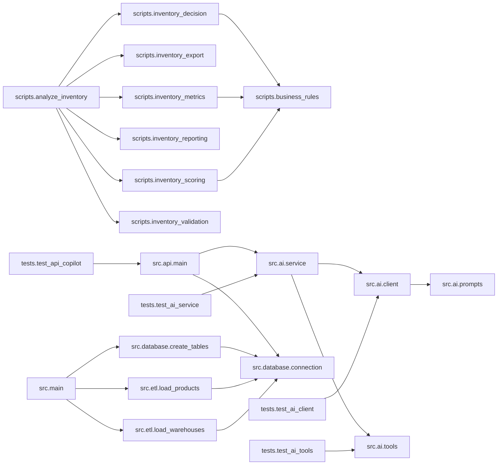

# Project Audit

Gerado em: 13/08/2026 20:58:01

> Este arquivo é gerado automaticamente. Não edite manualmente.

## 1. Resumo executivo

- Arquivos Python: **23**
- Linhas totais: **3232**
- Linhas efetivas de código: **2437**
- Funções: **118**
- Classes: **5**
- Imports internos: **24**
- Imports externos: **18**
- Imports da biblioteca padrão: **25**
- TODOs/FIXMEs em comentários: **0**
- Funções sem docstring: **16**
- Arquivos com erro de sintaxe: **0**

## 2. Como usar as opções True e False

As variáveis abaixo ficam no início de `project_audit.py`:

```python
INCLUIR_CODIGO_FONTE = False
INCLUIR_FERRAMENTAS_AUDITORIA = False
```

- `False`: mantém a opção desativada.
- `True`: ativa a opção.
- Para o checkpoint normal, mantenha as duas como `False`.
- Ative `INCLUIR_CODIGO_FONTE` somente quando precisar enviar todo o código para revisão.
- Ative `INCLUIR_FERRAMENTAS_AUDITORIA` somente quando quiser auditar também o próprio auditor.

## 3. Pipeline principal

```text
analyze_inventory.py
↓
inventory_validation.py
↓
inventory_metrics.py
↓
inventory_scoring.py
↓
inventory_decision.py
↓
inventory_reporting.py
↓
inventory_export.py
```

## 4. Entregas do projeto

| Entrega | Caminho | Status |
|---|---|:---:|
| Banco SQLite | `database/inventory.db` | ✅ |
| Arquivo analítico | `output/inventory_analysis.csv` | ✅ |
| Relatório Excel | `reports/excel/indicadores_r1.xlsx` | ✅ |
| Dashboard Power BI | `reports/powerbi/AI_Supply_Chain_Copilot.pbix` | ✅ |
| Screenshot do dashboard | `reports/powerbi/screenshots/dashboard.png` | ✅ |

## 5. Project Health

> Notas heurísticas calculadas automaticamente.

| Dimensão | Nota |
|---|---:|
| Modularização | 10.0/10 |
| Cobertura de docstrings | 8.6/10 |
| Complexidade estrutural | 9.1/10 |
| Integridade sintática | 10.0/10 |
| Saúde geral | **9.4/10** |

## 6. Estrutura do projeto

```text
ai-supply-chain-copilot/
├── .gitignore
├── config/
│   └── business_rules.json
├── data/
│   ├── processed/
│   │   └── .gitkeep
│   ├── raw/
│   │   ├── depositos.csv
│   │   └── produtos.csv
│   └── synthetic/
│       └── .gitkeep
├── database/
│   └── inventory.db
├── docs/
│   ├── architecture/
│   │   ├── 01_system_overview.md
│   │   ├── 02_current_architecture.md
│   │   ├── 03_data_model.md
│   │   └── 04_decision_log.md
│   ├── backlog/
│   │   └── backlog.md
│   ├── images/
│   │   ├── architecture-overview.png
│   │   └── first llm real answer.png
│   ├── presentations/
│   │   ├── AI-Supply-Chain-Copilot.pdf
│   │   └── AI-Supply-Chain-Copilot.pptx
│   ├── project_audit/
│   │   └── PROJECT_AUDIT.md
│   └── roadmap/
│       └── AI_Supply_Chain_Copilot_Gantt_v0.2.0.xlsx
├── output/
│   └── inventory_analysis.csv
├── README.md
├── reports/
│   ├── excel/
│   │   └── indicadores_r1.xlsx
│   └── powerbi/
│       ├── AI_Supply_Chain_Copilot.pbix
│       ├── screenshots/
│       │   └── dashboard.png
│       └── themes/
│           └── ai_supply_chain_dark.json
├── requirements.txt
├── sample_data/
│   └── erp_inventory.csv
├── scripts/
│   ├── analyze_inventory.py
│   ├── business_rules.py
│   ├── database_setup.py
│   ├── inventory_decision.py
│   ├── inventory_export.py
│   ├── inventory_metrics.py
│   ├── inventory_reporting.py
│   ├── inventory_scoring.py
│   ├── inventory_validation.py
│   └── project_audit.py
├── src/
│   ├── ai/
│   │   ├── client.py
│   │   ├── prompts.py
│   │   ├── service.py
│   │   └── tools.py
│   ├── api/
│   │   └── main.py
│   ├── database/
│   │   ├── connection.py
│   │   └── create_tables.py
│   ├── etl/
│   │   ├── load_products.py
│   │   └── load_warehouses.py
│   └── main.py
└── tests/
    ├── golden_test_set.md
    ├── test_ai_client.py
    ├── test_ai_service.py
    ├── test_ai_tools.py
    └── test_api_copilot.py
```

## 7. Arquivos Python

| Arquivo | Linhas | Funções | Classes | TODOs |
|---|---:|---:|---:|---:|
| `scripts/analyze_inventory.py` | 39 | 1 | 0 | 0 |
| `scripts/business_rules.py` | 63 | 2 | 0 | 0 |
| `scripts/database_setup.py` | 12 | 0 | 0 | 0 |
| `scripts/inventory_decision.py` | 121 | 5 | 0 | 0 |
| `scripts/inventory_export.py` | 96 | 3 | 0 | 0 |
| `scripts/inventory_metrics.py` | 119 | 5 | 0 | 0 |
| `scripts/inventory_reporting.py` | 228 | 5 | 0 | 0 |
| `scripts/inventory_scoring.py` | 123 | 6 | 0 | 0 |
| `scripts/inventory_validation.py` | 78 | 2 | 0 | 0 |
| `src/ai/client.py` | 255 | 7 | 0 | 0 |
| `src/ai/prompts.py` | 239 | 0 | 0 | 0 |
| `src/ai/service.py` | 100 | 2 | 0 | 0 |
| `src/ai/tools.py` | 74 | 1 | 0 | 0 |
| `src/api/main.py` | 209 | 8 | 1 | 0 |
| `src/database/connection.py` | 17 | 1 | 0 | 0 |
| `src/database/create_tables.py` | 121 | 5 | 0 | 0 |
| `src/etl/load_products.py` | 149 | 4 | 0 | 0 |
| `src/etl/load_warehouses.py` | 146 | 4 | 0 | 0 |
| `src/main.py` | 21 | 1 | 0 | 0 |
| `tests/test_ai_client.py` | 475 | 22 | 3 | 0 |
| `tests/test_ai_service.py` | 302 | 14 | 0 | 0 |
| `tests/test_ai_tools.py` | 135 | 14 | 1 | 0 |
| `tests/test_api_copilot.py` | 110 | 6 | 0 | 0 |

## 8. Funções e classes

### `scripts/analyze_inventory.py`

| Função | Linhas | Argumentos | Docstring |
|---|---:|---|---|
| `main` | 17–35 | `—` | SIM |

### `scripts/business_rules.py`

| Função | Linhas | Argumentos | Docstring |
|---|---:|---|---|
| `carregar_regras` | 15–33 | `—` | SIM |
| `validar_regras` | 36–55 | `regras` | SIM |

### `scripts/database_setup.py`

- Nenhuma função ou classe encontrada.

### `scripts/inventory_decision.py`

| Função | Linhas | Argumentos | Docstring |
|---|---:|---|---|
| `aplicar_decisoes` | 9–21 | `df` | SIM |
| `calcular_acao_recomendada` | 24–40 | `df` | SIM |
| `calcular_prioridade` | 43–75 | `df` | SIM |
| `gerar_grupo_gerencial` | 78–121 | `df` | SIM |
| `classificar_grupo_gerencial` | 84–116 | `linha` | SIM |

### `scripts/inventory_export.py`

| Função | Linhas | Argumentos | Docstring |
|---|---:|---|---|
| `exportar_resultados` | 11–24 | `df, caminho_saida` | SIM |
| `exportar_csv` | 27–52 | `df, caminho_saida` | SIM |
| `exportar_excel` | 55–96 | `df, caminho_excel` | SIM |

### `scripts/inventory_metrics.py`

| Função | Linhas | Argumentos | Docstring |
|---|---:|---|---|
| `calcular_metricas` | 9–23 | `df` | SIM |
| `calcular_valor_estoque` | 26–34 | `df` | SIM |
| `calcular_cobertura_e_risco` | 37–76 | `df` | SIM |
| `calcular_quantidades_e_valores` | 79–105 | `df` | SIM |
| `calcular_valor_acao` | 108–119 | `df` | SIM |

### `scripts/inventory_reporting.py`

| Função | Linhas | Argumentos | Docstring |
|---|---:|---|---|
| `exibir_relatorio` | 4–15 | `df` | SIM |
| `exibir_exploracao` | 18–37 | `df` | SIM |
| `exibir_acoes_recomendadas` | 40–77 | `df` | SIM |
| `exibir_distribuicao_das_acoes` | 80–103 | `df` | SIM |
| `exibir_resumo_executivo` | 106–228 | `df` | SIM |

### `scripts/inventory_scoring.py`

| Função | Linhas | Argumentos | Docstring |
|---|---:|---|---|
| `calcular_scores` | 9–24 | `df` | SIM |
| `calcular_score_financeiro` | 27–52 | `df` | SIM |
| `calcular_score_classe_abc` | 55–69 | `df` | SIM |
| `calcular_score_risco_ruptura` | 72–86 | `df` | SIM |
| `calcular_score_lead_time` | 89–108 | `df` | SIM |
| `calcular_score_prioridade` | 111–123 | `df` | SIM |

### `scripts/inventory_validation.py`

| Função | Linhas | Argumentos | Docstring |
|---|---:|---|---|
| `validar_dados` | 17–41 | `df` | SIM |
| `detalhar_problemas` | 44–78 | `df` | SIM |

### `src/ai/client.py`

| Função | Linhas | Argumentos | Docstring |
|---|---:|---|---|
| `validar_configuracao_cliente` | 25–53 | `—` | SIM |
| `validar_limites_contexto` | 56–85 | `contexto` | SIM |
| `montar_requisicao` | 88–108 | `pergunta, contexto` | SIM |
| `gerar_resposta` | 111–143 | `pergunta, contexto` | SIM |
| `gerar_resposta_real` | 146–178 | `pergunta, contexto` | SIM |
| `gerar_resposta_fake` | 181–207 | `pergunta, contexto` | SIM |
| `obter_quantidade_registros` | 210–226 | `contexto` | SIM |

### `src/ai/prompts.py`

- Nenhuma função ou classe encontrada.

### `src/ai/service.py`

| Função | Linhas | Argumentos | Docstring |
|---|---:|---|---|
| `preparar_contexto` | 10–71 | `inventario` | SIM |
| `responder` | 74–88 | `pergunta` | SIM |

### `src/ai/tools.py`

| Função | Linhas | Argumentos | Docstring |
|---|---:|---|---|
| `listar_inventario` | 11–62 | `—` | SIM |

### `src/api/main.py`

| Função | Linhas | Argumentos | Docstring |
|---|---:|---|---|
| `carregar_inventario` | 14–29 | `—` | SIM |
| `raiz` | 51–59 | `—` | SIM |
| `verificar_saude` | 63–70 | `—` | SIM |
| `listar_produtos` | 74–105 | `—` | SIM |
| `buscar_produto` | 109–144 | `sku` | SIM |
| `listar_inventario` | 148–157 | `—` | SIM |
| `obter_dashboard` | 161–186 | `—` | SIM |
| `consultar_copilot` | 190–209 | `entrada` | SIM |

| Classe | Linhas | Docstring |
|---|---:|---|
| `PerguntaCopilot` | 32–37 | SIM |

### `src/database/connection.py`

| Função | Linhas | Argumentos | Docstring |
|---|---:|---|---|
| `conectar_banco` | 8–17 | `—` | SIM |

### `src/database/create_tables.py`

| Função | Linhas | Argumentos | Docstring |
|---|---:|---|---|
| `criar_tabela_produtos` | 4–20 | `cursor` | SIM |
| `criar_tabela_depositos` | 23–37 | `cursor` | SIM |
| `criar_tabela_parametros_estoque` | 40–66 | `cursor` | SIM |
| `criar_tabela_movimentacoes_estoque` | 69–94 | `cursor` | SIM |
| `criar_tabelas` | 97–117 | `—` | SIM |

### `src/etl/load_products.py`

| Função | Linhas | Argumentos | Docstring |
|---|---:|---|---|
| `extrair_produtos` | 11–21 | `—` | SIM |
| `transformar_produtos` | 24–93 | `df` | SIM |
| `carregar_produtos` | 96–130 | `df` | SIM |
| `main` | 133–145 | `—` | SIM |

### `src/etl/load_warehouses.py`

| Função | Linhas | Argumentos | Docstring |
|---|---:|---|---|
| `extrair_depositos` | 11–21 | `—` | SIM |
| `transformar_depositos` | 24–88 | `df` | SIM |
| `carregar_depositos` | 91–127 | `df` | SIM |
| `main` | 130–142 | `—` | SIM |

### `src/main.py`

| Função | Linhas | Argumentos | Docstring |
|---|---:|---|---|
| `main` | 6–17 | `—` | SIM |

### `tests/test_ai_client.py`

| Função | Linhas | Argumentos | Docstring |
|---|---:|---|---|
| `test_gerar_resposta_utiliza_cliente_fake` | 6–51 | `monkeypatch` | SIM |
| `gerar_resposta_fake` | 23–32 | `pergunta, contexto` | NÃO |
| `test_gerar_resposta_rejeita_pergunta_vazia` | 54–63 | `—` | SIM |
| `test_gerar_resposta_rejeita_modo_nao_suportado` | 66–85 | `monkeypatch` | SIM |
| `test_gerar_resposta_fake_sem_contexto` | 88–103 | `—` | SIM |
| `test_gerar_resposta_fake_conta_lista_de_registros` | 106–125 | `—` | SIM |
| `test_gerar_resposta_fake_contexto_nao_lista` | 128–144 | `—` | SIM |
| `test_montar_requisicao_inclui_system_prompt` | 147–165 | `—` | SIM |
| `test_montar_requisicao_preserva_pergunta_e_contexto` | 168–196 | `—` | SIM |
| `test_montar_requisicao_rejeita_pergunta_vazia` | 199–212 | `—` | SIM |
| `test_obter_quantidade_registros_contexto_estruturado` | 215–234 | `—` | SIM |
| `test_validar_configuracao_cliente_aceita_modo_fake` | 237–254 | `monkeypatch` | SIM |
| `test_validar_configuracao_cliente_bloqueia_real_sem_autorizacao` | 257–281 | `monkeypatch` | SIM |
| `test_validar_configuracao_cliente_real_exige_api_key` | 284–311 | `monkeypatch` | SIM |
| `test_validar_configuracao_cliente_rejeita_modo_invalido` | 314–329 | `monkeypatch` | SIM |
| `test_validar_limites_contexto_aceita_contexto_pequeno` | 332–349 | `—` | SIM |
| `test_validar_limites_contexto_rejeita_contexto_excessivo` | 352–374 | `monkeypatch` | SIM |
| `test_montar_requisicao_bloqueia_contexto_excessivo` | 377–402 | `monkeypatch` | SIM |
| `test_limite_tokens_resposta_possui_valor_controlado` | 405–412 | `—` | SIM |
| `test_gerar_resposta_real_utiliza_responses_api` | 415–475 | `monkeypatch` | SIM |
| `create` | 443–458 | `self, model, instructions, input, max_output_tokens` | NÃO |
| `__init__` | 461–462 | `self` | NÃO |

| Classe | Linhas | Docstring |
|---|---:|---|
| `RespostaFake` | 439–440 | NÃO |
| `ResponsesFake` | 442–458 | NÃO |
| `OpenAIFake` | 460–462 | NÃO |

### `tests/test_ai_service.py`

| Função | Linhas | Argumentos | Docstring |
|---|---:|---|---|
| `test_responder_orquestra_fluxo_corretamente` | 4–75 | `monkeypatch` | SIM |
| `listar_inventario_fake` | 26–27 | `—` | NÃO |
| `gerar_resposta_fake` | 29–59 | `pergunta, contexto` | NÃO |
| `test_responder_propaga_erro_da_tool` | 78–99 | `monkeypatch` | SIM |
| `listar_inventario_fake` | 84–85 | `—` | NÃO |
| `test_responder_propaga_erro_do_client` | 102–139 | `monkeypatch` | SIM |
| `listar_inventario_fake` | 115–116 | `—` | NÃO |
| `gerar_resposta_fake` | 118–119 | `pergunta, contexto` | NÃO |
| `test_preparar_contexto_retorna_resumo_e_registros` | 142–173 | `—` | SIM |
| `test_preparar_contexto_ordena_por_prioridade_e_valor` | 176–211 | `—` | SIM |
| `test_preparar_contexto_respeita_limite_de_registros` | 214–232 | `—` | SIM |
| `test_preparar_contexto_trata_inventario_vazio` | 235–250 | `—` | SIM |
| `test_preparar_contexto_trata_campos_ausentes` | 253–275 | `—` | SIM |
| `test_preparar_contexto_identifica_contexto_parcial` | 278–302 | `—` | SIM |

### `tests/test_ai_tools.py`

| Função | Linhas | Argumentos | Docstring |
|---|---:|---|---|
| `__init__` | 14–15 | `self, dados` | NÃO |
| `read` | 17–21 | `self` | SIM |
| `__enter__` | 23–27 | `self` | SIM |
| `__exit__` | 29–33 | `self, exc_type, exc_value, traceback` | SIM |
| `test_listar_inventario_retorna_dados_convertidos` | 36–61 | `monkeypatch` | SIM |
| `urlopen_fake` | 51–55 | `requisicao, timeout` | NÃO |
| `test_listar_inventario_gera_erro_para_json_invalido` | 64–78 | `monkeypatch` | SIM |
| `urlopen_fake` | 69–70 | `requisicao, timeout` | NÃO |
| `test_listar_inventario_gera_erro_de_conexao` | 81–95 | `monkeypatch` | SIM |
| `urlopen_fake` | 86–87 | `requisicao, timeout` | NÃO |
| `test_listar_inventario_gera_erro_http` | 98–118 | `monkeypatch` | SIM |
| `urlopen_fake` | 103–110 | `requisicao, timeout` | NÃO |
| `test_listar_inventario_gera_erro_de_timeout` | 121–135 | `monkeypatch` | SIM |
| `urlopen_fake` | 126–127 | `requisicao, timeout` | NÃO |

| Classe | Linhas | Docstring |
|---|---:|---|
| `RespostaFake` | 9–33 | SIM |

### `tests/test_api_copilot.py`

| Função | Linhas | Argumentos | Docstring |
|---|---:|---|---|
| `test_consultar_copilot_retorna_resposta` | 10–41 | `monkeypatch` | SIM |
| `responder_fake` | 19–21 | `pergunta_recebida` | NÃO |
| `test_consultar_copilot_rejeita_corpo_sem_pergunta` | 44–55 | `—` | SIM |
| `test_consultar_copilot_rejeita_corpo_invalido` | 58–71 | `—` | SIM |
| `test_consultar_copilot_trata_erros_da_camada_de_ia` | 82–110 | `monkeypatch, erro` | SIM |
| `responder_fake` | 91–92 | `pergunta` | NÃO |

## 9. Dependências

### Dependências internas

| Origem | Destino |
|---|---|
| `scripts.analyze_inventory` | `scripts.inventory_validation` |
| `scripts.analyze_inventory` | `scripts.inventory_metrics` |
| `scripts.analyze_inventory` | `scripts.inventory_scoring` |
| `scripts.analyze_inventory` | `scripts.inventory_decision` |
| `scripts.analyze_inventory` | `scripts.inventory_reporting` |
| `scripts.analyze_inventory` | `scripts.inventory_export` |
| `scripts.inventory_decision` | `scripts.business_rules` |
| `scripts.inventory_metrics` | `scripts.business_rules` |
| `scripts.inventory_scoring` | `scripts.business_rules` |
| `src.ai.client` | `src.ai.prompts` |
| `src.ai.service` | `src.ai.client` |
| `src.ai.service` | `src.ai.tools` |
| `src.api.main` | `src.ai.service` |
| `src.api.main` | `src.database.connection` |
| `src.database.create_tables` | `src.database.connection` |
| `src.etl.load_products` | `src.database.connection` |
| `src.etl.load_warehouses` | `src.database.connection` |
| `src.main` | `src.database.create_tables` |
| `src.main` | `src.etl.load_products` |
| `src.main` | `src.etl.load_warehouses` |
| `tests.test_ai_client` | `src.ai.client` |
| `tests.test_ai_service` | `src.ai.service` |
| `tests.test_ai_tools` | `src.ai.tools` |
| `tests.test_api_copilot` | `src.api.main` |

### Dependências externas

- `fastapi`
- `openai`
- `pandas`
- `pydantic`
- `pytest`

### Grafo de dependências internas



## 10. Observações automáticas do repositório

- Nenhuma observação de padronização encontrada.

## 11. Pendências e erros

### TODOs e FIXMEs

- Nenhum TODO ou FIXME encontrado em comentários.

### Erros de sintaxe

- Nenhum erro de sintaxe encontrado.
